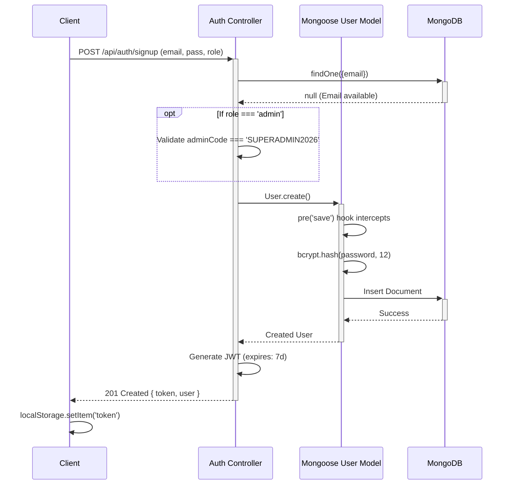
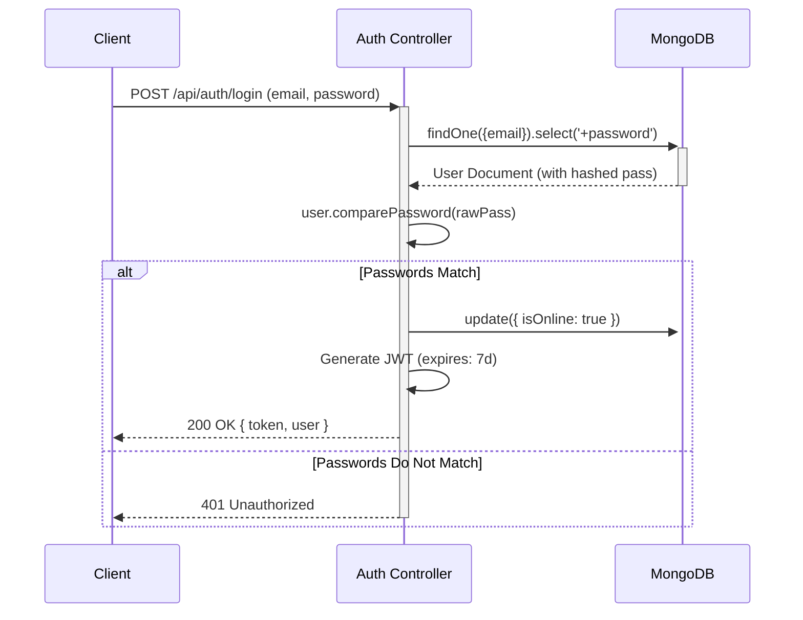

# COMPLETE AUTHENTICATION GUIDE
**Project:** Life Saviour  
**Security Architecture:** Stateless JWT (JSON Web Tokens)  

This guide details the end-to-end authentication and authorization flows securing the Life Saviour platform, covering both client-side handling and server-side verification.

---

## 1. Registration Flow
The registration process handles user creation, role assignment, and secure credential storage.

**Flow Description:**
1. The user submits their details (name, email, password, role) via the frontend `/signup` page.
2. If the user selects the `admin` role, they must provide a hardcoded secret admin code (`SUPERADMIN2026`).
3. The server checks if the email already exists in the `users` collection.
4. The Mongoose model automatically intercepts the save event, hashes the password using bcrypt, and stores the user.
5. A JWT is generated and returned to the client alongside the user data.

**Sequence Diagram:**

---

## 2. Login Flow
The login process verifies credentials and issues a new session token.

**Sequence Diagram:**

---

## 3. JWT (JSON Web Token)
Life Saviour uses JWTs for **stateless session management**. 
- **Structure:** `Header.Payload.Signature`
- **Payload:** Contains the user's `id` and `role`. 
- **Signing:** Signed using the `JWT_SECRET` environment variable.
- **Why?** The server does not need to look up a session ID in a database or Redis cache. If the cryptographic signature is valid, the server trusts the payload, allowing massive horizontal scaling.

## 4. Refresh Tokens
*Note: Refresh tokens are currently **not implemented** in Life Saviour.*
Currently, the system issues a single access token valid for **7 days**. 
*Future Improvement:* Implement short-lived access tokens (e.g., 15 minutes) and long-lived refresh tokens stored as HttpOnly cookies to mitigate the impact of a compromised access token.

## 5. Password Hashing & 6. bcrypt
Passwords are **never** stored in plain text.
- The system uses `bcryptjs` with a **cost factor (salt rounds) of 12**.
- This makes hashing computationally expensive, heavily defending against brute-force and rainbow table attacks if the database is ever compromised.
- **Mongoose `pre('save')` Hook:** Hashing is decoupled from the controller. Anytime a `User` document is saved, the model checks `this.isModified('password')`. If true, it hashes the new password automatically. This guarantees developers can never accidentally save a plaintext password.

## 7. Middleware
Authentication and Authorization are enforced via Express middleware (`server/src/middleware/auth.js`).
- **`protect` Middleware:** Intercepts the request, reads the `Authorization: Bearer <token>` header, verifies the signature, and attaches the corresponding MongoDB user document to `req.user`. If the token is missing or invalid, it aborts the request with a `401 Unauthorized`.

## 8. Protected Routes & 9. Authorization
- **Server-Side Authorization:** The `authorize(...roles)` factory middleware sits after `protect`. It checks if `req.user.role` is included in the allowed roles array. If a patient tries to access `POST /api/emergencies/:id/assign-doctor`, it throws a `403 Forbidden`.
- **Client-Side Protected Routes:** In React, the `<ProtectedRoute>` component wraps sensitive pages. It checks the `AuthContext`. If no user is logged in, it redirects to `/login`. If the user's role does not match the page (e.g., a Driver trying to view the Doctor Dashboard), it blocks rendering and redirects.

## 10. Session Management & 11. Logout
- **Session Management:** Entirely client-side. The JWT is stored in `localStorage` and injected into every API request via an Axios interceptor (`client/src/services/api.js`).
- **Logout:** Since JWTs are stateless, the server cannot explicitly "invalidate" a token before it expires (without a blacklist). Therefore, logging out simply consists of the frontend calling `localStorage.removeItem('token')` and `AuthContext.setUser(null)`, followed by a redirect to the login screen.

---

## 12. Security & Attack Prevention

| Attack Vector | Current Prevention Mechanism | Vulnerability / Improvement |
|---------------|------------------------------|-----------------------------|
| **Brute Force** | None native to the codebase. | **Vulnerable.** Add rate-limiting (`express-rate-limit`) to the `/api/auth/login` endpoint. |
| **SQL Injection** | Immune (Uses NoSQL MongoDB). | - |
| **NoSQL Injection** | Mongoose inherently sanitizes inputs by strictly casting types against the Schema definition. | Ensure `express-mongo-sanitize` is added to strip `$` and `.` operators from `req.body`. |
| **XSS (Cross-Site Scripting)** | React automatically escapes DOM injections. | **Vulnerable.** Because the JWT is stored in `localStorage`, any successful XSS attack can read the token and hijack the session. |
| **CSRF (Cross-Site Request Forgery)** | Immune. Relies on `Authorization` header, not automatic cookie transmission. | - |
| **Data Leakage** | Passwords are excluded from queries via Mongoose `select: false`. | - |

---

## 13. Best Practices (Current & Recommended)

**What we do well:**
- **Centralized Hashing:** Relying on the Mongoose schema hook prevents developers from forgetting to hash a password during a profile update.
- **Role-Based Middlewares:** Decoupling authentication (`protect`) from authorization (`authorize`) allows highly granular access control.
- **Fail-Safe Axios Interceptors:** The frontend globally catches `401` errors and forces a local logout, preventing the UI from locking up with stale tokens.

**Recommended Architectural Upgrades:**
1. **Migrate to HttpOnly Cookies:** Moving the JWT from `localStorage` to an `HttpOnly`, `Secure`, `SameSite` cookie makes it completely invisible to JavaScript, neutralizing token theft via XSS attacks.
2. **Implement Token Blacklisting:** Currently, if a user logs out, their token is still valid for 7 days if intercepted. Implementing a Redis-based blacklist for logged-out tokens would secure this edge case.
3. **Implement Rate Limiting:** Apply strict limiters to `/login` to prevent dictionary attacks.
