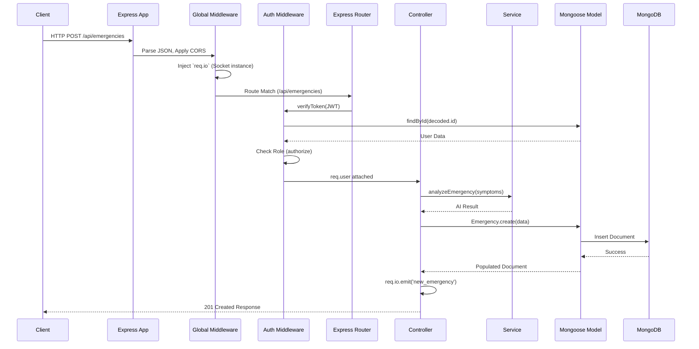

# BACKEND ARCHITECTURE GUIDE
**Project:** Life Saviour  
**Framework:** Node.js, Express.js  
**Database ODM:** Mongoose  

This guide provides a deep dive into the server-side architecture, explaining how HTTP requests and WebSocket events are orchestrated, validated, and processed.

---

## 1. Request Lifecycle Diagram

This diagram illustrates the journey of a secure API request (e.g., `POST /api/emergencies`) through the backend layers.

---

## 2. Server Startup
The entry point is `server.js`. Because the application requires both REST APIs and real-time WebSockets, standard `app.listen()` is insufficient. 
Instead, the Express `app` is wrapped using Node's native `http` module (`http.createServer(app)`). This allows the `Server` instance from `socket.io` to bind to the exact same port (e.g., 5000) as the REST API, eliminating CORS complexities of running separate WebSocket servers.

## 3. Middleware Flow
Middleware forms the pipeline through which every request travels:
1. **Global Parsers:** `express.json()` and `cors()`.
2. **Socket Injection:** A critical custom middleware runs on every request: `app.use((req, res, next) => { req.io = io; next(); })`. This injects the Socket.IO instance into the HTTP request object, allowing any controller to broadcast events.
3. **Route-Specific Middleware:** Attached in the route definition files (e.g., `protect`, `upload.single()`).
4. **Error Handling:** Catch-all error middleware at the bottom of the stack.

## 4. Routing
Routes are modularized in `server/src/routes/` (e.g., `emergencyRoutes.js`, `authRoutes.js`). The router maps specific URL paths and HTTP verbs to their corresponding Controller methods, acting strictly as a traffic director.

## 5. Controllers
Controllers sit in `server/src/controllers/`. They adhere to the **Single Responsibility Principle**.
- **Role:** Extract data from `req.body`, `req.params`, and `req.user`. Pass this data to the appropriate Service. Receive the result, and format the HTTP response (e.g., `res.status(201).json(...)`).
- **Rule:** Controllers contain *no heavy business logic* or external API calls.

## 6. Services
Services (`server/src/services/`) are the heavy lifters containing pure domain logic.
- Examples: `aiService.js`, `hospitalService.js`, `dispatchService.js`.
- **Why?** Decoupling logic from the HTTP request object allows a Service to be called by an HTTP Controller, a Socket Event, or a Cron Job without rewriting code.

## 7. Models & 14. Database Communication
Models (`server/src/models/`) define the MongoDB schema using Mongoose.
- The backend communicates with MongoDB purely through these Object Data Mapping (ODM) models.
- **Smart Models:** They contain schema-level logic. For example, `User.js` utilizes a `pre('save')` hook to automatically intercept and hash any modified password before it hits the database.

## 8. Authentication, 9. Authorization, & 10. JWT
Security is handled by `server/src/middleware/auth.js`.
- **Authentication (`protect`):** Extracts the JWT from the `Authorization: Bearer` header, verifies the cryptographic signature, extracts the user ID, fetches the fresh user document from MongoDB, and attaches it to `req.user`.
- **Authorization (`authorize`):** A factory middleware function (e.g., `authorize('doctor', 'admin')`). It checks if `req.user.role` exists in the allowed array. If not, it blocks execution with a `403 Forbidden`.

## 11. Socket.IO
The real-time engine is isolated in `server/src/sockets/chatSocket.js`.
- Utilizes a **Room-based architecture**. When a user connects to an emergency, they emit `join_emergency` with the ID. The server calls `socket.join(emergencyId)`.
- All subsequent events (chat messages, GPS updates) are broadcast *only* to that room (`io.to(emergencyId).emit(...)`), drastically reducing network overhead and ensuring strict data privacy.

## 12. Error Handling & 13. Validation
- **Validation:** Primarily enforced at the Mongoose schema level (required fields, enums). Controllers also perform manual checks (e.g., verifying a file exists before processing).
- **Error Handling:** Controllers wrap execution in `try/catch` blocks. If an error occurs, it is caught, logged, and passed to `res.status(500)` to prevent the Node process from crashing.

## 15. External APIs
The backend orchestrates external data via Services:
- **Google Gemini API:** Abstracted in `aiService.js` for triage and `aiChatService.js` for the pre-triage assistant.
- **OpenStreetMap (Nominatim):** Abstracted for reverse-geocoding coordinates into human-readable locations.

## 16. Background Tasks
Certain tasks are intentionally detached from the main HTTP request/response lifecycle.
- **Example:** When a doctor is assigned (`POST /assign-doctor`), the server must generate a summary of the AI chat. LLM generation takes ~3 seconds. Instead of making the doctor wait 3 seconds for the HTTP response, the Controller fires the HTTP `200 OK` immediately and executes `aiChatService.generateSummary()` in the background (as a detached promise).

## 17. Scalability
- **The Good:** The API is highly scalable because authentication (JWT) is **stateless**. The load balancer can spin up 10 Node.js instances, and any instance can verify the token without checking a session store.
- **The Bottleneck:** Socket.IO is currently stateful. If Client A connects to Node Instance 1, and Client B connects to Node Instance 2, they cannot chat. To scale horizontally, a **Redis Adapter** must be added to Socket.IO so instances can publish events to each other. Additionally, the Multer local `/uploads/` directory must be migrated to AWS S3.
