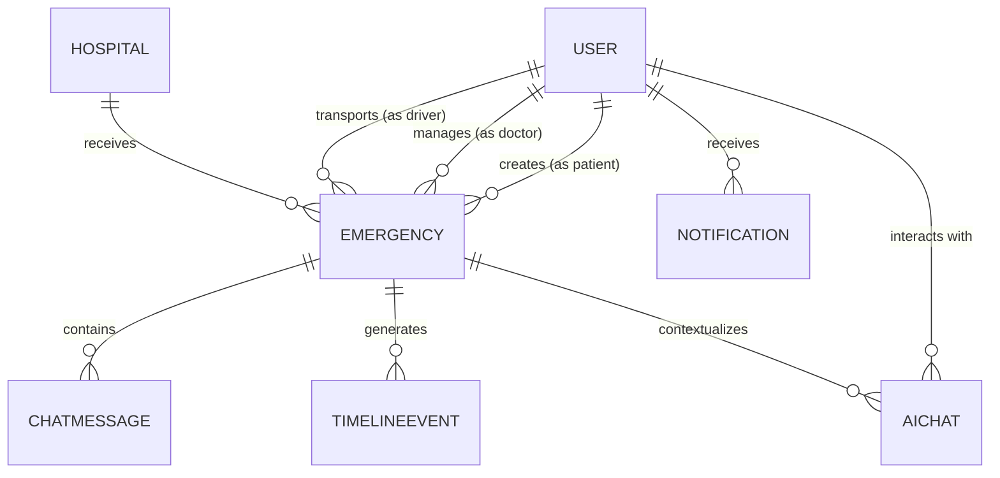

# COMPLETE DATABASE DOCUMENTATION 
**Project:** Life Saviour  
**Database:** MongoDB (via Mongoose ODM)  

This document outlines the exact database schema and architecture of the Life Saviour platform. It strictly reflects the existing Mongoose models in `server/src/models/`.

---

## 1. Global Entity Relationship Diagram (ERD)



---

## 2. Collection: `users`

**Purpose:** 
Stores authentication credentials, role definitions, and profile data for all human participants (Patients, Doctors, Drivers, Admins) on the platform.

**Schema & Fields:**
| Field | Data Type | Required | Default | Validation / Enum |
|-------|-----------|----------|---------|-------------------|
| `name` | String | Yes | - | minLength: 2 |
| `email` | String | Yes | - | Unique, lowercase, regex match |
| `password` | String | Yes | - | minLength: 6, `select: false` |
| `phone` | String | No | - | - |
| `role` | String | Yes | `'patient'` | `['patient', 'doctor', 'driver', 'admin']` |
| `specialization` | String | No | - | `['cardiology', 'trauma', 'neurology', 'general', ...]` (Doctors only) |
| `hospitalAffiliation` | ObjectId | No | - | Refs `Hospital` |
| `vehicleNumber` | String | No | - | Drivers only |
| `currentLocation.lat` | Number | No | - | - |
| `currentLocation.lng` | Number | No | - | - |
| `availabilityStatus` | String | No | `'available'` | `['available', 'busy', 'offline']` |
| `emergencyContacts` | Array | No | `[]` | Array of objects `{name, phone, relation}` |
| `preferredLanguage` | String | No | `'en'` | `['en', 'hi', 'te']` |
| `isOnline` | Boolean | No | `false` | - |

**Relationships & References:**
- `hospitalAffiliation` references the `hospitals` collection.

**CRUD Operations:**
- **Create:** `POST /api/auth/signup`
- **Read:** `GET /api/auth/me`, Driver discovery via `dispatchService`
- **Update:** Driver status updates during emergency assignment
- **Delete:** (None currently implemented in API)

**Indexes:**
- `email` (Unique, 1)

**Performance Considerations:**
The polymorphic design (`role` enum) avoids `$lookup` joins when fetching different user types, but requires application-level logic to ensure fields like `vehicleNumber` aren't populated for patients.

**Sample Document:**
```json
{
  "_id": "64a1b2c3d4e5f60001234567",
  "name": "Dr. Sarah Smith",
  "email": "sarah@hospital.com",
  "role": "doctor",
  "specialization": "cardiology",
  "hospitalAffiliation": "64a1b2c3d4e5f60001234999",
  "preferredLanguage": "en",
  "isOnline": true
}
```

**Aggregation Pipelines:**
Used in `analyticsRoutes` to count active responders (`$match: { role: { $in: ['doctor', 'driver'] }, isOnline: true }`).

**Security Concerns:**
`password` uses `select: false` at the schema level to prevent accidental exposure during `User.find()` queries. A Mongoose `pre('save')` hook strictly manages bcrypt hashing.

---

## 3. Collection: `emergencies`

**Purpose:** 
The central nervous system of the app. It tracks a medical incident from creation through AI triage, hospital allocation, transit, and resolution.

**Schema & Fields:**
| Field | Data Type | Required | Default | Validation / Enum |
|-------|-----------|----------|---------|-------------------|
| `patientId` | ObjectId | Yes | - | Refs `User` |
| `patientName` | String | Yes | - | - |
| `assignedDoctor` | ObjectId | No | `null` | Refs `User` |
| `assignedDriver` | ObjectId | No | `null` | Refs `User` |
| `assignedHospital` | ObjectId | No | `null` | Refs `Hospital` |
| `status` | String | Yes | `'pending'` | `['pending', 'assigned', 'in_progress', 'dropped_off', 'resolved', 'cancelled']` |
| `severity` | String | Yes | - | `['low', 'medium', 'high', 'critical']` |
| `transportType` | String | Yes | `'ambulance'`| `['ambulance', 'cab', 'self']` |
| `coordinates.lat` | Number | Yes | - | - |
| `coordinates.lng` | Number | Yes | - | - |
| `locationName` | String | No | - | - |
| `symptoms` | String | Yes | - | - |
| `triageInputs` | Object | No | - | `breathingDifficulty`, `painLevel` (1-10) |
| `aiTriage` | Object | No | - | Nested object containing Gemini output |
| `wearableSnapshot` | Object | No | - | Heart rate, SpO2 at time of SOS |
| `attachments` | Array | No | `[]` | Array of `{url, category, uploadedAt}` |
| `resolvedAt` | Date | No | - | - |

**Relationships & References:**
- Refs `User` (patientId, assignedDoctor, assignedDriver)
- Refs `Hospital` (assignedHospital)

**CRUD Operations:**
- **Create:** `POST /api/emergencies`
- **Read:** `GET /active`, `GET /mine`
- **Update:** `PATCH /:id`, `POST /:id/assign-doctor`, `POST /:id/resolve`

**Indexes:**
- `status` (1)
- `assignedHospital` (1)
- (Missing but recommended: `2dsphere` on coordinates)

**Performance Considerations:**
A heavy document. The `aiTriage` and `attachments` arrays can grow large. Over-fetching this document in list views wastes bandwidth; queries like `GET /active` should ideally use `.select('-attachments')` if files aren't needed in the list view.

**Sample Document:**
```json
{
  "_id": "64b999c3d4e5f60001234567",
  "patientId": "64a...",
  "status": "pending",
  "severity": "critical",
  "coordinates": { "lat": 17.714, "lng": 83.323 },
  "symptoms": "Chest pain",
  "aiTriage": {
    "category": "cardiac",
    "severityScore": 95,
    "priorityLevel": "critical",
    "recommendedDepartment": "ER - Cardiology",
    "chatSummary": "Patient reports pain radiating to left arm..."
  }
}
```

**Aggregation Pipelines:**
Heavily aggregated in `heatmapRoutes.js`:
- `$group` by hourly timestamps to calculate trend lines.
- `$geoNear` or coordinate grouping to identify hotspots.

**Security Concerns:**
Data contains highly sensitive Protected Health Information (PHI). Strict authorization middleware ensures doctors can only fetch emergencies assigned to their `hospitalAffiliation`.

---

## 4. Collection: `hospitals`

**Purpose:** 
Defines the physical medical infrastructure in the network, tracking real-time bed capacity and specializations to allow the allocation algorithm to route patients effectively.

**Schema & Fields:**
| Field | Data Type | Required | Default | Validation / Enum |
|-------|-----------|----------|---------|-------------------|
| `name` | String | Yes | - | - |
| `zone` | String | Yes | - | `['North', 'South', 'East', 'West', 'Central']` |
| `location.lat` | Number | Yes | - | - |
| `location.lng` | Number | Yes | - | - |
| `capacity.emergencyBeds`| Object | Yes | - | `{ total: Number, available: Number }` |
| `capacity.icuBeds` | Object | Yes | - | `{ total: Number, available: Number }` |
| `status` | String | Yes | `'active'` | `['active', 'full', 'maintenance']` |

**Relationships & References:**
- Referenced by `User` (Doctors) and `Emergency`.

**CRUD Operations:**
- **Create:** `POST /api/hospitals` (Admin only)
- **Read:** `GET /api/hospitals`, internal `hospitalService`
- **Update:** Incremental decrements via `hospitalService.allocateHospital()`

**Performance Considerations:**
The capacity fields (`available`) are highly volatile and updated concurrently during disaster events. 

**Aggregation Pipelines:**
Used in `analyticsRoutes` to calculate network load:
```javascript
{
  $project: {
    loadPercentage: {
      $multiply: [
        { $divide: [ { $subtract: ["$capacity.emergencyBeds.total", "$capacity.emergencyBeds.available"] }, "$capacity.emergencyBeds.total" ] },
        100
      ]
    }
  }
}
```

**Security Concerns:**
Updates to bed capacity via the REST API must be strictly restricted to Admins to prevent malicious denial of service (setting all beds to 0). Currently, decrements happen internally during emergency creation.

---

## 5. Collection: `chatmessages`

**Purpose:** 
Persists the real-time textual communication and image sharing between Patient, Doctor, and Driver during an active emergency.

**Schema & Fields:**
| Field | Data Type | Required | Default | Validation / Enum |
|-------|-----------|----------|---------|-------------------|
| `emergencyId` | ObjectId | Yes | - | Refs `Emergency` |
| `senderId` | ObjectId | Yes | - | Refs `User` |
| `senderRole` | String | Yes | - | `['patient', 'doctor', 'driver']` |
| `type` | String | Yes | `'text'` | `['text', 'image', 'system']` |
| `content` | String | Yes | - | Text message or Image URL |
| `timestamp` | Date | No | `Date.now`| - |

**Indexes:**
- `emergencyId` (1) - Critical for fast loading of chat history when a user joins the room.

**Performance Considerations:**
This collection grows extremely fast. It should be queried using pagination or a limit (e.g., `limit(50)`) when loading the `EmergencyChat` component.

---

## 6. Collection: `aichats`

**Purpose:** 
Stores the conversation history specifically between a Patient and the Google Gemini pre-triage assistant.

**Schema & Fields:**
| Field | Data Type | Required | Default | Validation / Enum |
|-------|-----------|----------|---------|-------------------|
| `emergencyId` | ObjectId | Yes | - | Refs `Emergency` |
| `patientId` | ObjectId | Yes | - | Refs `User` |
| `history` | Array | Yes | `[]` | Array of Gemini prompt objects `{ role: 'user'/'model', parts: [{text}] }` |

**Performance Considerations:**
The `history` array can bloat if conversations go on too long. The `aiChatService` actively slices this array to keep only the most recent 10 messages before saving and sending to the Gemini API to prevent token limit errors.

---

## 7. Collection: `timelineevents`

**Purpose:** 
Maintains a chronological, immutable audit log of every major state change in an emergency.

**Schema & Fields:**
| Field | Data Type | Required | Default | Validation / Enum |
|-------|-----------|----------|---------|-------------------|
| `emergencyId` | ObjectId | Yes | - | Refs `Emergency` |
| `eventType` | String | Yes | - | `['created', 'hospital_assigned', 'doctor_assigned', 'ambulance_dispatched', 'resolved']` |
| `title` | String | Yes | - | - |
| `description` | String | No | - | - |
| `actorId` | ObjectId | No | - | Refs `User` (Who triggered the event) |
| `timestamp` | Date | No | `Date.now`| - |

**Security Concerns:**
This is an append-only audit log. There are intentionally no REST endpoints to update or delete `TimelineEvent` documents to preserve clinical accountability.

---

## 8. Collection: `notifications`

**Purpose:** 
Stores in-app push notifications directed at specific users (e.g., alerting a doctor to a new case).

**Schema & Fields:**
| Field | Data Type | Required | Default | Validation / Enum |
|-------|-----------|----------|---------|-------------------|
| `recipientId` | ObjectId | Yes | - | Refs `User` |
| `title` | String | Yes | - | - |
| `message` | String | Yes | - | - |
| `type` | String | Yes | - | `['system', 'emergency_alert', 'status_update']` |
| `priority` | String | No | `'medium'`| `['low', 'medium', 'high', 'critical']` |
| `isRead` | Boolean | No | `false` | - |
| `relatedEntityId` | ObjectId | No | - | e.g., The Emergency ID |

**Indexes:**
- `recipientId` (1)
- `isRead` (1)

**Performance Considerations:**
A TTL (Time-To-Live) index on the `createdAt` field is highly recommended here to automatically delete notifications older than 30 days and prevent endless database bloat.
