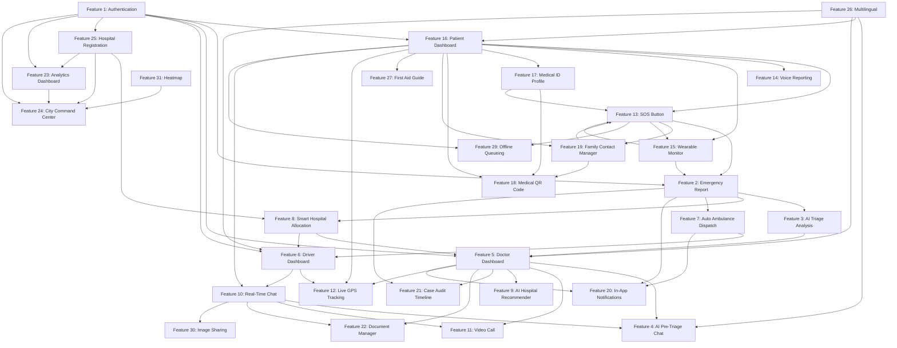

# 🚨 LIFE SAVIOUR — COMPLETE FEATURE INVENTORY DOCUMENT

> **Generated from:** Full codebase scan of `c:\Users\SAAHITTHI\OneDrive\Desktop\life`  
> **Stack:** React + Vite (Frontend) · Node.js + Express (Backend) · MongoDB (Database) · Socket.IO (Real-time) · Google Gemini AI  
> **Roles:** `patient` · `doctor` · `driver` · `admin`

---

## SECTION A — FULLY IMPLEMENTED FEATURES

---

### FEATURE 1: User Authentication (Register & Login)

| Field | Detail |
|-------|--------|
| **Feature Name** | User Authentication |
| **Category** | Authentication |
| **Purpose** | Secure role-based account creation and login for patients, doctors, drivers, and admins. Each role unlocks a different dashboard and set of capabilities. |

**User Story:**  
*"As a user, I can register an account with my role and credentials so that I can securely access my role-specific dashboard and emergency features."*

**Complete User Flow:**
1. User navigates to `/signup`
2. Fills name, email, password, phone, role selection
3. If role is `doctor` → selects specialization + hospital affiliation
4. If role is `driver` → enters vehicle number
5. If role is `admin` → enters secret code `SUPERADMIN2026`
6. Submits form → account created → JWT token returned
7. User redirected to role dashboard
8. On login: enters email + password → JWT issued → redirect

**Complete System Flow:**
1. `POST /api/auth/signup` called with payload
2. `authController.signup()` validates admin code if role=admin
3. Checks `User.findOne({ email })` — rejects if duplicate
4. Creates user via `User.create()` — bcrypt hashes password (cost=12) via pre-save hook
5. Generates JWT (7-day expiry) via `jwt.sign({ id, role })`
6. Returns `{ token, user: { id, name, email, role } }`
7. On login: `POST /api/auth/login` → finds user with `.select('+password')` → `user.comparePassword()` → sets `isOnline=true` → returns JWT

**Frontend Components:**
- [`Login.jsx`](file:///c:/Users/SAAHITTHI/OneDrive/Desktop/life/client/src/pages/Login.jsx) — login form
- [`Signup.jsx`](file:///c:/Users/SAAHITTHI/OneDrive/Desktop/life/client/src/pages/Signup.jsx) — registration form
- [`ProtectedRoute.jsx`](file:///c:/Users/SAAHITTHI/OneDrive/Desktop/life/client/src/components/ProtectedRoute.jsx) — role-based route guard
- [`Navbar.jsx`](file:///c:/Users/SAAHITTHI/OneDrive/Desktop/life/client/src/layouts/Navbar.jsx) — shows/hides links based on auth state

**Backend Services:**
- [`authController.js`](file:///c:/Users/SAAHITTHI/OneDrive/Desktop/life/server/src/controllers/authController.js)
- [`auth.js (middleware)`](file:///c:/Users/SAAHITTHI/OneDrive/Desktop/life/server/src/middleware/auth.js) — JWT verification + user lookup

**Database Collections:** `users`

**APIs:**
- `POST /api/auth/signup`
- `POST /api/auth/login`
- `GET /api/auth/me`

**Validation Rules:**
- Name: 2–50 chars, required
- Email: regex `/^\S+@\S+\.\S+$/`, unique, lowercase
- Password: min 6 chars
- Role: enum `['patient', 'doctor', 'driver', 'admin']`
- Admin role: requires secret code `SUPERADMIN2026`
- Doctor specialization: enum `['cardiology', 'trauma', 'neurology', 'respiratory', 'general', 'orthopedics', 'pediatrics']`

**Error Handling:**
- Duplicate email → `400 "User already exists with this email"`
- Invalid admin code → `403 "Invalid Secret Admin Code. Access Denied."`
- Wrong password → `401 "Invalid email or password"`
- Invalid token in middleware → `401 "Not authorized, token failed"`

**Security Measures:**
- bcrypt password hashing (saltRounds=12)
- JWT with 7-day expiry
- Password field excluded from DB queries by default (`select: false`)
- Role-based route protection via `ProtectedRoute` + `authorize()` middleware

**Dependencies on Other Features:** None (base feature)

**Edge Cases Handled:**
- Duplicate email detection before creation
- Admin code gating
- Role-conditional fields (specialization only for doctors, vehicleNumber only for drivers)

**Status:** ✅ Fully Implemented

---

### FEATURE 2: Emergency Report Submission

| Field | Detail |
|-------|--------|
| **Feature Name** | Emergency Report Submission |
| **Category** | Emergency Response |
| **Purpose** | Allow patients to report medical emergencies with symptoms, location, triage data, and optional wearable vitals snapshot for immediate system processing. |

**User Story:**  
*"As a patient, I can submit an emergency report with my symptoms and location so that dispatchers, doctors, and ambulances are alerted and dispatched automatically."*

**Complete User Flow:**
1. Patient opens Patient Dashboard → clicks "🚨 Report Now"
2. Modal opens with form
3. Fills: Patient Name, Age, Gender, Blood Group
4. Types/pastes location OR clicks "Locate Me" for GPS
5. Selects severity (low/medium/critical) and transport type (ambulance/cab)
6. Enters symptoms via text or Voice Input
7. Fills triage inputs: Breathing Difficulty (1–10), Pain Level (1–10), Consciousness State
8. Optionally adds notes (auto-pre-filled with allergies/medications from Medical ID)
9. If wearable is connected → snapshot automatically attached
10. Submits → Emergency created → AI triage runs → Navigated to `/chat`

**Complete System Flow:**
1. `POST /api/emergencies` called
2. `emergencyController.createEmergency()`:
   - Calls `aiService.analyzeEmergency()` → Gemini AI returns `{ category, severityScore, priorityLevel, recommendedDepartment, analysisSummary }`
   - Falls back to keyword-based triage if AI fails
   - Creates `Emergency` document in MongoDB
   - Calls `hospitalService.allocateHospital()` → finds optimal hospital (zone match + specialization match + bed availability + doctor online check)
   - Decrements hospital bed counters; marks hospital "full" if capacity ≤ 10%
   - Creates timeline event via `timelineService.createEvent()`
   - Emits `new_emergency` socket event to all connected users
   - Filters online doctors by specialization + hospital affiliation → sends in-app notifications
   - If transport=ambulance → calls `dispatchService.assignNearestAmbulance()` automatically

**Frontend Components:**
- [`PatientDashboard.jsx`](file:///c:/Users/SAAHITTHI/OneDrive/Desktop/life/client/src/pages/PatientDashboard.jsx) — form modal, state management
- [`VoiceEmergencyAssistant.jsx`](file:///c:/Users/SAAHITTHI/OneDrive/Desktop/life/client/src/components/VoiceEmergencyAssistant.jsx) — microphone input for symptoms
- [`TransliterateInput.jsx`](file:///c:/Users/SAAHITTHI/OneDrive/Desktop/life/client/src/components/TransliterateInput.jsx) — multilingual text entry

**Backend Services:**
- [`emergencyController.js`](file:///c:/Users/SAAHITTHI/OneDrive/Desktop/life/server/src/controllers/emergencyController.js)
- [`aiService.js`](file:///c:/Users/SAAHITTHI/OneDrive/Desktop/life/server/src/services/aiService.js) — Gemini AI triage
- [`hospitalService.js`](file:///c:/Users/SAAHITTHI/OneDrive/Desktop/life/server/src/services/hospitalService.js) — hospital allocation
- [`dispatchService.js`](file:///c:/Users/SAAHITTHI/OneDrive/Desktop/life/server/src/services/dispatchService.js) — ambulance assignment
- [`notificationService.js`](file:///c:/Users/SAAHITTHI/OneDrive/Desktop/life/server/src/services/notificationService.js)
- [`timelineService.js`](file:///c:/Users/SAAHITTHI/OneDrive/Desktop/life/server/src/services/timelineService.js)

**Database Collections:** `emergencies`, `users`, `hospitals`, `notifications`, `timelineevents`

**APIs:**
- `POST /api/emergencies`
- External: Nominatim OpenStreetMap reverse geocoding (for location name)
- External: Google Gemini AI (`gemini-2.5-flash`)

**Validation Rules:**
- patientName, age, gender, bloodGroup, location, severity, symptoms: required
- age: Number
- gender: enum `['male', 'female', 'other']`
- bloodGroup: enum `['A+', 'A-', 'B+', 'B-', 'AB+', 'AB-', 'O+', 'O-']`
- severity: enum `['low', 'medium', 'critical']`
- transportType: enum `['ambulance', 'cab']`
- triageInputs.breathingDifficulty: Number 1–10
- triageInputs.painLevel: Number 1–10
- triageInputs.consciousnessState: enum `['conscious', 'confused', 'unconscious']`

**Error Handling:**
- AI triage failure → keyword-based fallback triage runs automatically
- Hospital allocation failure → emergency created without hospital assignment
- Offline detection → queues emergency in IndexedDB via `offlineService`

**Security Measures:**
- JWT authentication required (`protect` middleware)
- Patient ID auto-assigned from JWT (`req.user._id`) — not from request body

**Dependencies on Other Features:**
- AI Triage Analysis (#3)
- Smart Hospital Allocation (#9)
- Auto Ambulance Dispatch (#10)
- In-App Notifications (#19)
- Wearable Health Monitor (#22)
- Offline Sync (#30)

**Edge Cases Handled:**
- Offline → queued to IndexedDB, synced on reconnect
- GPS unavailable → manual location entry
- AI service down → keyword fallback triage
- No hospital available → emergency created without `assignedHospital`
- Wearable connected → vitals snapshot auto-included

**Status:** ✅ Fully Implemented

---

### FEATURE 3: AI Emergency Triage Analysis

| Field | Detail |
|-------|--------|
| **Feature Name** | AI Emergency Triage Analysis |
| **Category** | AI Features |
| **Purpose** | Automatically assess emergency severity, medical category, priority level, and recommended department using Google Gemini AI upon emergency creation. |

**User Story:**  
*"As a system, I automatically analyze every incoming emergency with AI so that critical cases are prioritized and routed to the correct medical specialists."*

**Complete User Flow:**
1. Emergency form submitted by patient
2. System automatically runs AI triage (invisible to user)
3. Results displayed in patient dashboard under "AI Smart Triage" panel
4. Doctor sees AI category, severity score, recommended department in their dashboard

**Complete System Flow:**
1. `aiService.analyzeEmergency()` called with `{ symptoms, age, notes, breathingDifficulty, painLevel, consciousnessState }`
2. Structured prompt sent to Gemini `gemini-2.5-flash` model
3. Response parsed → JSON `{ category, severityScore, priorityLevel, recommendedDepartment, analysisSummary }`
4. Stored in `emergency.aiTriage` sub-document
5. If AI fails → smart keyword-based fallback: scans symptoms for cardiac/neuro/respiratory/trauma keywords + pain/breathing scores
6. `aiTriage.category` used for doctor notification routing and hospital specialization matching

**Frontend Components:**
- [`PatientDashboard.jsx`](file:///c:/Users/SAAHITTHI/OneDrive/Desktop/life/client/src/pages/PatientDashboard.jsx) — "AI Smart Triage" display panel
- [`DoctorDashboard.jsx`](file:///c:/Users/SAAHITTHI/OneDrive/Desktop/life/client/src/pages/DoctorDashboard.jsx) — AI triage block on each emergency card

**Backend Services:**
- [`aiService.js`](file:///c:/Users/SAAHITTHI/OneDrive/Desktop/life/server/src/services/aiService.js)

**Database Collections:** `emergencies` (`aiTriage` sub-document)

**APIs:**
- Google Gemini API (`gemini-2.5-flash` via `@google/generative-ai`)

**Validation Rules:**
- Response must contain keys: `category`, `severityScore`, `priorityLevel`, `recommendedDepartment`, `analysisSummary`
- JSON parsed after stripping markdown fences

**Error Handling:**
- JSON parse failure → fallback triage based on keywords + numeric triage inputs
- API timeout or rate limit → fallback triggered automatically
- Fallback triage: cardiac, neuro, respiratory, trauma, general categories detected

**Security Measures:**
- API key stored in `.env` (`GEMINI_API_KEY`)
- Never exposed to client

**Dependencies:** Emergency Report Submission (#2)

**Edge Cases Handled:**
- AI API completely unavailable → deterministic keyword fallback
- Malformed JSON response → regex extraction attempted then fallback
- Unknown symptoms → defaults to `general` category, `medium` priority

**Status:** ✅ Fully Implemented

---

### FEATURE 4: AI Pre-Triage Chat Assistant (Patient)

| Field | Detail |
|-------|--------|
| **Feature Name** | AI Pre-Triage Chat Assistant |
| **Category** | AI Features |
| **Purpose** | Provide an intelligent conversational AI assistant that gathers additional medical information from the patient before doctor assignment, offering reassurance and first-aid guidance. |

**User Story:**  
*"As a patient in an emergency, I can chat with an AI assistant so that it gathers my symptoms, reassures me, and provides first-aid guidance while help is being dispatched."*

**Complete User Flow:**
1. Patient submits emergency → navigated to `/chat`
2. AI Chat Assistant panel visible on right sidebar
3. AI greets patient and asks about their situation
4. Patient types responses → AI continues conversation, asks follow-up questions
5. AI provides calm guidance and first-aid instructions
6. If life-threatening keywords detected → AI escalates severity flag
7. When doctor accepts emergency → AI generates a clinical summary from chat history

**Complete System Flow:**
1. `POST /api/ai-chat/message` called with `{ emergencyId, message, history, language }`
2. `aiChatService.getChatResponse()` builds Gemini chat session with `systemInstruction`
3. Last 10 messages of history cleaned (ensures alternating user/model roles)
4. Gemini `gemini-2.5-flash` responds in text (not JSON — plain conversational response)
5. Escalation detection via keyword scan (`critical`, `emergency room`, `ambulance`)
6. Response stored in `AIChat` collection
7. On doctor assignment: `generateSummary()` runs async (non-blocking via `setImmediate`)
8. Summary stored in `aiTriage.chatSummary` on Emergency document
9. Doctor reads summary in patient chart

**Frontend Components:**
- [`AIChatAssistant.jsx`](file:///c:/Users/SAAHITTHI/OneDrive/Desktop/life/client/src/components/AIChatAssistant.jsx) — chat UI, message history display
- [`EmergencyChat.jsx`](file:///c:/Users/SAAHITTHI/OneDrive/Desktop/life/client/src/pages/EmergencyChat.jsx) — sidebar rendering
- [`DoctorDashboard.jsx`](file:///c:/Users/SAAHITTHI/OneDrive/Desktop/life/client/src/pages/DoctorDashboard.jsx) — read-only AI chat view in patient chart

**Backend Services:**
- [`aiChatService.js`](file:///c:/Users/SAAHITTHI/OneDrive/Desktop/life/server/src/services/aiChatService.js) — conversation management, summary generation
- [`aiChatController.js`](file:///c:/Users/SAAHITTHI/OneDrive/Desktop/life/server/src/controllers/aiChatController.js)

**Database Collections:** `aichats` (messages, summary), `emergencies` (`aiTriage.chatSummary`)

**APIs:**
- `POST /api/ai-chat/message`
- Google Gemini API (`gemini-2.5-flash`)

**Validation Rules:**
- emergencyId required
- Message history must alternate user/model roles (enforced by cleanHistory logic)
- History capped at last 10 messages to prevent token overflow

**Error Handling:**
- API failure → language-specific fallback messages (`en`, `hi`, `te`)
- Malformed JSON from model → multiple extraction strategies (direct parse → strip markdown → regex → plain text)
- Missing/trailing `model` role in history → cleaned before sending

**Security Measures:**
- JWT authentication required
- Emergency must belong to authenticated user or assigned doctor

**Dependencies:** Emergency Report Submission (#2), Multilingual Support (#28)

**Edge Cases Handled:**
- AI responds in wrong language → `systemInstruction` enforces language
- Empty history → `generateContent()` used instead of `startChat()`
- Doctor not yet assigned → summary generation skipped
- Wearable snapshot → included in summary context if available

**Status:** ✅ Fully Implemented

---

### FEATURE 5: Doctor Dashboard & Emergency Management

| Field | Detail |
|-------|--------|
| **Feature Name** | Doctor Dashboard & Emergency Management |
| **Category** | Emergency Response |
| **Purpose** | Give doctors a real-time workspace to view, accept, manage, and resolve emergencies assigned to their hospital and specialization. |

**User Story:**  
*"As a doctor, I can see all active emergencies filtered by my hospital and specialization so that I can accept cases, review patient charts, monitor wearable vitals, and resolve emergencies."*

**Complete User Flow:**
1. Doctor logs in → redirected to `/dashboard/doctor`
2. Dashboard shows 4 KPI stats: Active Cases, My Assigned, Resolved, Total Handled
3. Tabs: Active Emergencies | My Cases | History
4. Active tab shows emergencies matching doctor's hospital + specialization
5. Doctor clicks "Accept Emergency" → assigned to case
6. Clicks "View Chart" → modal with full patient data (demographics, symptoms, AI triage, wearable vitals, AI chat summary, AI hospital recommendation, timeline, document manager)
7. Clicks "Join Chat" → goes to `/chat`
8. Clicks video call icon → WebRTC peer-to-peer video consultation
9. Clicks "Resolve" on My Cases tab → emergency marked resolved
10. History tab shows all resolved cases

**Complete System Flow:**
1. `GET /api/emergencies/active` → filtered by `hospitalAffiliation` (hospital matched) + `specialization` → returns sorted by `aiTriage.severityScore DESC`
2. On "Accept": `POST /api/emergencies/:id/assign-doctor` → validates specialization match → sets `assignedDoctor = req.user._id`, `status = 'assigned'`
3. Background (non-blocking): Gemini generates AI chat summary incorporating wearable data
4. Emits `emergency_updated` socket event
5. Sends notification to patient: "Doctor Assigned"
6. Creates timeline event: "Doctor Assigned"
7. Socket listener for `wearable_update` → updates live vitals in patient chart modal
8. On resolve: `POST /api/emergencies/:id/resolve` → `status='resolved'`, `resolvedAt=now`

**Frontend Components:**
- [`DoctorDashboard.jsx`](file:///c:/Users/SAAHITTHI/OneDrive/Desktop/life/client/src/pages/DoctorDashboard.jsx)
- [`VideoCall.jsx`](file:///c:/Users/SAAHITTHI/OneDrive/Desktop/life/client/src/components/VideoCall.jsx)
- [`Timeline.jsx`](file:///c:/Users/SAAHITTHI/OneDrive/Desktop/life/client/src/components/Timeline.jsx)
- [`AIChatAssistant.jsx`](file:///c:/Users/SAAHITTHI/OneDrive/Desktop/life/client/src/components/AIChatAssistant.jsx) — read-only mode
- [`SmartHospitalPanel.jsx`](file:///c:/Users/SAAHITTHI/OneDrive/Desktop/life/client/src/components/SmartHospitalPanel.jsx)
- [`DocumentManager.jsx`](file:///c:/Users/SAAHITTHI/OneDrive/Desktop/life/client/src/components/DocumentManager.jsx)
- [`DynamicText.jsx`](file:///c:/Users/SAAHITTHI/OneDrive/Desktop/life/client/src/components/DynamicText.jsx)

**Backend Services:**
- [`emergencyController.js`](file:///c:/Users/SAAHITTHI/OneDrive/Desktop/life/server/src/controllers/emergencyController.js)
- [`aiChatService.js`](file:///c:/Users/SAAHITTHI/OneDrive/Desktop/life/server/src/services/aiChatService.js)
- [`notificationService.js`](file:///c:/Users/SAAHITTHI/OneDrive/Desktop/life/server/src/services/notificationService.js)
- [`timelineService.js`](file:///c:/Users/SAAHITTHI/OneDrive/Desktop/life/server/src/services/timelineService.js)

**Database Collections:** `emergencies`, `users`, `hospitals`, `aichats`, `timelineevents`, `notifications`

**APIs:**
- `GET /api/emergencies/active`
- `GET /api/emergencies/mine`
- `POST /api/emergencies/:id/assign-doctor`
- `POST /api/emergencies/:id/resolve`
- `GET /api/emergencies/:id/timeline`

**Validation Rules:**
- Specialization must match emergency category (unless doctor is `general`)
- Hospital affiliation must match assigned hospital
- Duplicate doctor assignment rejected: `400 "Emergency already has an assigned doctor"`

**Error Handling:**
- Specialization mismatch → `403` with message specifying required specialist
- Emergency not found → `404`
- AI summary failure (background) → logged, emergency proceeds normally

**Security Measures:**
- JWT required; role must be `doctor`
- Hospital affiliation strictly enforced on both query AND accept

**Dependencies:** Emergency Report Submission (#2), AI Triage (#3), AI Chat (#4), Video Call (#13), Wearable Monitor (#22), Timeline (#20)

**Edge Cases Handled:**
- Doctor refreshes page → socket re-registers listeners
- Ambulance dropped off (`dropped_off` status) → toast alert sent to assigned doctor
- No active emergencies → empty state shown

**Status:** ✅ Fully Implemented

---

### FEATURE 6: Driver Dashboard & Ambulance Dispatch

| Field | Detail |
|-------|--------|
| **Feature Name** | Driver Dashboard & Ambulance Dispatch |
| **Category** | Emergency Response |
| **Purpose** | Enable ambulance drivers to view available missions, accept dispatch orders, navigate to patients, broadcast live GPS location, and mark patient delivery. |

**User Story:**  
*"As a driver, I can see available emergency missions, accept one, navigate to the patient with live GPS, and mark arrival so the doctor is notified."*

**Complete User Flow:**
1. Driver logs in → `/dashboard/driver`
2. Sees stats: Active Mission | Available Jobs | Completed Trips
3. Available Missions section shows unassigned emergencies (where doctor accepted or transport=cab)
4. Driver clicks "Accept Mission" → assigned to emergency
5. Active Mission panel shows: Pickup Location, Patient Condition, Assigned Hospital
6. Clicks "Start Navigation" → status set to `in_progress`
7. "Tracking Live Location" button opens Google Maps with waypoints (patient → hospital)
8. GPS broadcasts to backend every 5 seconds
9. Patient/Doctor see live ambulance marker on map
10. Driver clicks "Mark Arrived & Complete" → status set to `dropped_off`
11. Doctor receives toast: "Ambulance Arrived!"
12. Trip moves to Recent Trips history

**Complete System Flow:**
1. Page load: `GET /api/emergencies/active` (all active) + `GET /api/emergencies/mine` (driver's missions)
2. Socket listeners: `new_emergency`, `emergency_updated` → auto-refresh
3. On accept: `POST /api/emergencies/:id/assign-driver` → sets `assignedDriver = req.user._id`
4. Global GPS watch: `navigator.geolocation.watchPosition` → emits `driver_location_update` socket event with `{ userId, lat, lng }`
5. Mission GPS watch: emits `location_update` to emergency room every 5 seconds → patient/doctor maps update
6. On `in_progress`: `PATCH /api/emergencies/:id` with `{ status: 'in_progress' }`
7. On `dropped_off`: `PATCH /api/emergencies/:id` with `{ status: 'dropped_off' }` → triggers doctor notification via socket

**Frontend Components:**
- [`DriverDashboard.jsx`](file:///c:/Users/SAAHITTHI/OneDrive/Desktop/life/client/src/pages/DriverDashboard.jsx)
- [`DynamicText.jsx`](file:///c:/Users/SAAHITTHI/OneDrive/Desktop/life/client/src/components/DynamicText.jsx)

**Backend Services:**
- [`emergencyController.js`](file:///c:/Users/SAAHITTHI/OneDrive/Desktop/life/server/src/controllers/emergencyController.js)
- [`chatSocket.js`](file:///c:/Users/SAAHITTHI/OneDrive/Desktop/life/server/src/sockets/chatSocket.js)

**Database Collections:** `emergencies`, `users`

**APIs:**
- `GET /api/emergencies/active`
- `GET /api/emergencies/mine`
- `POST /api/emergencies/:id/assign-driver`
- `PATCH /api/emergencies/:id`
- Socket: `location_update`, `driver_location_update`

**Validation Rules:**
- Driver can only accept if `availabilityStatus === 'available'`
- One active mission at a time (accept button disabled if mission active)

**Error Handling:**
- GPS unavailable → falls back to Visakhapatnam city center coordinates (for testing)
- API failure on accept → toast error shown

**Security Measures:**
- JWT required; role must be `driver`

**Dependencies:** Emergency Report Submission (#2), Live Location Tracking (#11), Real-time Chat (#12)

**Edge Cases Handled:**
- Driver has no GPS → falls back to last known coordinates
- Multiple rapid GPS updates → debounced via 5-second interval broadcast
- Driver refreshes → active mission and GPS tracking restored from state

**Status:** ✅ Fully Implemented

---

### FEATURE 7: Auto Ambulance Dispatch (Nearest Driver)

| Field | Detail |
|-------|--------|
| **Feature Name** | Auto Ambulance Dispatch |
| **Category** | Emergency Response |
| **Purpose** | Automatically assign the nearest available ambulance driver to an emergency at the moment it is created, without requiring manual driver selection. |

**User Story:**  
*"As the system, I automatically dispatch the nearest available ambulance when a patient creates an emergency with transport type 'ambulance'."*

**Complete User Flow:**
1. Patient creates emergency with `transportType = 'ambulance'`
2. System automatically finds and assigns nearest driver (no user interaction)
3. Driver receives push notification: "🚨 NEW MISSION ASSIGNED"
4. Patient receives notification: "🚑 Ambulance Dispatched" with ETA

**Complete System Flow:**
1. `dispatchService.assignNearestAmbulance()` called after emergency creation
2. Finds all drivers with `availabilityStatus = 'available'` and `currentLocation.lat` set
3. Computes Haversine distance from each driver to emergency coordinates
4. Selects minimum distance driver
5. Updates emergency: `assignedDriver = nearestDriver._id`, `status = 'assigned'`
6. Updates driver: `availabilityStatus = 'busy'`
7. ETA estimated via `geoUtils.estimateTime(distanceKm)`
8. In-app notification to driver + patient via `notificationService`
9. Emits `emergency_updated` socket event

**Frontend Components:** None (server-side only)

**Backend Services:**
- [`dispatchService.js`](file:///c:/Users/SAAHITTHI/OneDrive/Desktop/life/server/src/services/dispatchService.js)
- [`geoUtils.js`](file:///c:/Users/SAAHITTHI/OneDrive/Desktop/life/server/src/utils/geoUtils.js)
- [`notificationService.js`](file:///c:/Users/SAAHITTHI/OneDrive/Desktop/life/server/src/services/notificationService.js)

**Database Collections:** `users`, `emergencies`, `notifications`

**APIs:** (Internal service — no direct HTTP endpoint)

**Validation Rules:**
- Driver must have `currentLocation.lat` in database
- Emergency must have `coordinates.lat`

**Error Handling:**
- No available drivers → logs "No available drivers found", returns null
- Missing coordinates → returns null (dispatch skipped)

**Security Measures:** Runs within authenticated emergency creation context

**Dependencies:** Emergency Report Submission (#2), In-App Notifications (#19)

**Edge Cases Handled:**
- All drivers busy → silently skipped, doctor can manually assign driver
- Driver coordinates missing → driver excluded from selection
- Tie in distance → first found wins (no tie-breaking)

**Status:** ✅ Fully Implemented

---

### FEATURE 8: Smart Hospital Allocation

| Field | Detail |
|-------|--------|
| **Feature Name** | Smart Hospital Allocation |
| **Category** | Emergency Response |
| **Purpose** | Automatically find and assign the best hospital for an emergency based on zone match, specialization, bed availability, ICU capacity, and proximity. |

**User Story:**  
*"As the system, I automatically assign the best available hospital when an emergency is created so that patients are routed to appropriate care."*

**Complete User Flow:**
1. Emergency created by patient
2. Hospital assigned invisibly in the background
3. Hospital name displayed in patient's active emergency panel
4. Doctor sees assigned hospital in emergency card
5. Hospital bed counts decremented automatically

**Complete System Flow:**
1. `hospitalService.allocateHospital()` called
2. Priority cascades: Zone+Spec → Zone+Any → Any+Spec → Any+Any
3. Filter hospitals with >10% bed capacity
4. Find hospitals with at least one ONLINE doctor of matching specialization
5. If no online doctors → fallback to absolute nearest hospital
6. Decrement `emergencyBeds.available` (and `icuBeds.available` if critical)
7. Auto-set hospital status to "full" if capacity falls ≤10%

**Frontend Components:**
- [`PatientDashboard.jsx`](file:///c:/Users/SAAHITTHI/OneDrive/Desktop/life/client/src/pages/PatientDashboard.jsx) — displays assigned hospital name
- [`DriverDashboard.jsx`](file:///c:/Users/SAAHITTHI/OneDrive/Desktop/life/client/src/pages/DriverDashboard.jsx) — shows destination hospital

**Backend Services:**
- [`hospitalService.js`](file:///c:/Users/SAAHITTHI/OneDrive/Desktop/life/server/src/services/hospitalService.js)
- [`geoUtils.js`](file:///c:/Users/SAAHITTHI/OneDrive/Desktop/life/server/src/utils/geoUtils.js)

**Database Collections:** `hospitals`, `users`, `emergencies`

**APIs:** (Internal service)

**Validation Rules:**
- Hospital must have `status = 'active'`
- `emergencyBeds.available > 0`
- Capacity ratio > 10%

**Error Handling:**
- No hospitals in zone → escalates to city-wide search
- No hospitals available → emergency created without hospital (null assignment)

**Security Measures:** Runs within authenticated emergency creation context

**Dependencies:** Emergency Report Submission (#2), Hospital Registration (#24)

**Edge Cases Handled:**
- Zone has no hospitals → city-wide fallback
- All hospitals near capacity → strict 10% mathematical filter
- No online doctors → falls back to nearest regardless of doctor availability

**Status:** ✅ Fully Implemented

---

### FEATURE 9: AI Smart Hospital Recommender (Doctor View)

| Field | Detail |
|-------|--------|
| **Feature Name** | AI Smart Hospital Recommender |
| **Category** | AI Features |
| **Purpose** | Provide AI-driven hospital recommendations with confidence scores and reasoning factors for doctors viewing a patient chart, to support clinical decision-making. |

**User Story:**  
*"As a doctor, I can see AI-generated hospital recommendations with confidence scores so that I can make informed decisions about patient routing."*

**Complete User Flow:**
1. Doctor opens patient chart (View Chart button)
2. SmartHospitalPanel component fetches recommendations
3. Top 3 hospitals shown with confidence scores, distance, and reasoning factors
4. "Excellent" / "Suitable" / "Backup" suitability labels

**Complete System Flow:**
1. `GET /api/hospital-recommend/:emergencyId` called
2. `SmartHospitalRecommender.recommend()` fetches active hospitals
3. Scores each hospital: Specialization match (40pts) + Bed availability (25pts) + ICU (15pts) + Ventilator (10pts) + Not overloaded (10pts) + Proximity (30pts)
4. Normalized to confidence score out of 100
5. Returns top 3 sorted by score

**Frontend Components:**
- [`SmartHospitalPanel.jsx`](file:///c:/Users/SAAHITTHI/OneDrive/Desktop/life/client/src/components/SmartHospitalPanel.jsx)

**Backend Services:**
- [`SmartHospitalRecommender.js`](file:///c:/Users/SAAHITTHI/OneDrive/Desktop/life/server/src/services/SmartHospitalRecommender.js)
- [`hospitalRecommendRoutes.js`](file:///c:/Users/SAAHITTHI/OneDrive/Desktop/life/server/src/routes/hospitalRecommendRoutes.js)

**Database Collections:** `hospitals`, `emergencies`

**APIs:** `GET /api/hospital-recommend/:emergencyId`

**Validation Rules:**
- Emergency must exist with coordinates

**Error Handling:** Returns empty recommendations if no hospitals or emergency not found

**Dependencies:** Hospital Registration (#24), Emergency Report (#2)

**Edge Cases Handled:** Hospital with no coordinates → gets distance score 0 but still scored on other factors

**Status:** ✅ Fully Implemented

---

### FEATURE 10: Real-Time Emergency Chat

| Field | Detail |
|-------|--------|
| **Feature Name** | Real-Time Emergency Chat |
| **Category** | Communication |
| **Purpose** | Provide a live, multi-participant chat channel linking patient, doctor, and driver for real-time coordination during an emergency. |

**User Story:**  
*"As a patient, I can chat in real-time with my assigned doctor and driver so that I can receive guidance and updates during my emergency."*

**Complete User Flow:**
1. Patient/Doctor/Driver navigates to `/chat`
2. Emergency channel loaded for `activeEmergencyId`
3. Participant banner shows all connected roles
4. Messages appear in real-time with color-coded role bubbles
5. Typing indicator shows when others are typing
6. Can send images via camera icon
7. Read receipts (✓✓) shown for own messages
8. System messages for join events

**Complete System Flow:**
1. Socket joins room: `socket.join(emergencyId)`
2. `GET /api/chat/:emergencyId` fetches message history
3. `sendSocketMessage()` emits `send_message` socket event
4. Server persists to `ChatMessage` collection and emits `receive_message` to room
5. Typing: client emits `typing` → server broadcasts to room → client shows indicator
6. `stop_typing` emitted after 2s timeout
7. Image upload: `POST /api/chat/upload-image` → Multer saves file → image URL in socket message
8. Read receipt: `message_read` event emitted when message received

**Frontend Components:**
- [`EmergencyChat.jsx`](file:///c:/Users/SAAHITTHI/OneDrive/Desktop/life/client/src/pages/EmergencyChat.jsx)
- [`VideoCall.jsx`](file:///c:/Users/SAAHITTHI/OneDrive/Desktop/life/client/src/components/VideoCall.jsx) — embedded in chat header
- [`AIChatAssistant.jsx`](file:///c:/Users/SAAHITTHI/OneDrive/Desktop/life/client/src/components/AIChatAssistant.jsx) — sidebar
- [`DocumentManager.jsx`](file:///c:/Users/SAAHITTHI/OneDrive/Desktop/life/client/src/components/DocumentManager.jsx) — sidebar
- [`TransliterateInput.jsx`](file:///c:/Users/SAAHITTHI/OneDrive/Desktop/life/client/src/components/TransliterateInput.jsx)

**Backend Services:**
- [`chatSocket.js`](file:///c:/Users/SAAHITTHI/OneDrive/Desktop/life/server/src/sockets/chatSocket.js)
- [`chatController.js`](file:///c:/Users/SAAHITTHI/OneDrive/Desktop/life/server/src/controllers/chatController.js)
- [`chatRoutes.js`](file:///c:/Users/SAAHITTHI/OneDrive/Desktop/life/server/src/routes/chatRoutes.js)

**Database Collections:** `chatmessages`

**APIs:**
- `GET /api/chat/:emergencyId`
- `POST /api/chat/upload-image`
- Socket: `send_message`, `receive_message`, `typing`, `stop_typing`, `message_read`

**Validation Rules:**
- File must be `image/*` MIME type for image upload
- Empty messages not sent

**Error Handling:**
- Upload failure → error toast
- Invalid file type → rejection toast

**Security Measures:**
- JWT required; user must be `patient`, `doctor`, or `driver`
- Emergency ID validated client-side (redirects to dashboard if missing)

**Dependencies:** Emergency Report (#2), Video Call (#13), Document Manager (#21)

**Edge Cases Handled:**
- No emergency ID → redirect to own dashboard
- Duplicate messages (socket + HTTP) → deduplicated by `_id` comparison
- Driver excluded from AI/Document sidebar (role-conditional rendering)

**Status:** ✅ Fully Implemented

---

### FEATURE 11: Video Call (WebRTC Peer-to-Peer)

| Field | Detail |
|-------|--------|
| **Feature Name** | Video Call (WebRTC) |
| **Category** | Communication |
| **Purpose** | Enable real-time video consultation between doctor and patient during an emergency using peer-to-peer WebRTC via PeerJS. |

**User Story:**  
*"As a doctor, I can initiate a video call with my patient during an emergency so that I can visually assess their condition remotely."*

**Complete User Flow:**
1. Doctor/Patient in EmergencyChat or DoctorDashboard sees video camera icon
2. Video call only available after doctor accepts emergency
3. Doctor clicks icon → opens fullscreen modal → camera/mic activated
4. Doctor's peer initiates call to patient's peer ID
5. Patient sees incoming call → answers automatically (on modal open)
6. PiP layout: remote video fullscreen, own video draggable overlay
7. Mute, toggle video, end call controls

**Complete System Flow:**
1. Doctor opens modal → `new Peer(userId + '-' + emergencyId)` created
2. On `peer.open` → if role=doctor → calls `remoteId + '-' + emergencyId`
3. `navigator.mediaDevices.getUserMedia({ video: true, audio: true })`
4. PeerJS establishes P2P connection directly between browsers
5. `call.on('stream')` → renders remote video
6. On end: all media tracks stopped

**Frontend Components:**
- [`VideoCall.jsx`](file:///c:/Users/SAAHITTHI/OneDrive/Desktop/life/client/src/components/VideoCall.jsx)

**Backend Services:** PeerJS (client-to-client, no server relay)

**Database Collections:** None

**APIs:** PeerJS signaling server (public default)

**Validation Rules:**
- Video call only enabled when `emergency.assignedDoctor` is set

**Error Handling:**
- `getUserMedia` permission denied → call silently fails (no explicit error shown)

**Security Measures:**
- Peer IDs are non-guessable (userId + emergencyId combination)
- Labeled as "Encrypted" in UI

**Dependencies:** Real-Time Chat (#10), Emergency Report (#2)

**Edge Cases Handled:**
- Patient enters before doctor → waits for incoming call
- Camera already in use → browser prompt

**Status:** ✅ Fully Implemented

---

### FEATURE 12: Live Ambulance GPS Tracking (Map)

| Field | Detail |
|-------|--------|
| **Feature Name** | Live Ambulance GPS Tracking |
| **Category** | Location Services |
| **Purpose** | Show a live map with the ambulance, patient, and hospital markers so that patients and doctors can track rescue progress in real-time. |

**User Story:**  
*"As a patient, I can see my assigned ambulance moving on a map so that I know exactly when help will arrive."*

**Complete User Flow:**
1. Active emergency with `status=assigned/in_progress` and coordinates → map appears
2. Patient/Doctor sees map with 📍 (patient), 🏥 (hospital), 🚑 (ambulance) markers
3. Dashed polylines show: Ambulance→Patient route (blue) and Patient→Hospital route (green)
4. Ambulance marker updates in real-time as driver broadcasts location
5. Map auto-fits bounds to show all three markers

**Complete System Flow:**
1. Driver: `navigator.geolocation.watchPosition` → emits `location_update` socket event every 5 seconds
2. Patient/Doctor socket listener `location_update` → updates `driverLocation` state
3. `MapContainer` (Leaflet) re-renders ambulance marker at new coordinates
4. `MapUpdater` component calls `map.fitBounds()` to auto-zoom

**Frontend Components:**
- [`PatientDashboard.jsx`](file:///c:/Users/SAAHITTHI/OneDrive/Desktop/life/client/src/pages/PatientDashboard.jsx) — patient-side map (350px height)
- [`DoctorDashboard.jsx`](file:///c:/Users/SAAHITTHI/OneDrive/Desktop/life/client/src/pages/DoctorDashboard.jsx) — `DoctorLiveMap` component (250px)
- [`socket.js (client)`](file:///c:/Users/SAAHITTHI/OneDrive/Desktop/life/client/src/services/socket.js)

**Backend Services:**
- [`chatSocket.js`](file:///c:/Users/SAAHITTHI/OneDrive/Desktop/life/server/src/sockets/chatSocket.js) — socket room management
- OpenStreetMap tiles (via Leaflet TileLayer)

**Database Collections:** None (socket-only, not persisted)

**APIs:**
- Socket: `location_update` (emit/receive)
- Nominatim OSM reverse geocoding (for initial location name)

**Validation Rules:** Map only renders when `emergency.coordinates.lat` exists and status is `assigned` or `in_progress`

**Error Handling:**
- No driver location → spinner + "Connecting to Ambulance GPS..." overlay

**Security Measures:**
- Location updates only broadcast within emergency-specific socket room

**Dependencies:** Emergency Report (#2), Driver Dashboard (#6)

**Edge Cases Handled:**
- Hospital coordinates missing → offset from patient coordinates (test fallback)
- Driver offline → map stays at last known position

**Status:** ✅ Fully Implemented

---

### FEATURE 13: One-Tap SOS Button

| Field | Detail |
|-------|--------|
| **Feature Name** | One-Tap SOS Button |
| **Category** | Emergency Response |
| **Purpose** | Enable patients to trigger an immediate emergency with a single tap without filling any forms. Automatically uses GPS, medical profile, and wearable data. |

**User Story:**  
*"As a patient in a life-threatening situation, I can tap the SOS button once so that an emergency is automatically dispatched with my location and medical data—no form filling needed."*

**Complete User Flow:**
1. Patient sees pulsing red SOS button (fixed bottom-right, always visible in patient dashboard)
2. Taps SOS → modal opens with 5-second countdown + siren sound
3. "CANCEL SOS" button available
4. On expiry → GPS location fetched automatically
5. Emergency created with pre-filled data from Medical ID (blood group, allergies, medications)
6. WhatsApp message auto-sent to saved family contacts
7. Redirected to `/chat`

**Complete System Flow:**
1. 5-second timer runs in UI
2. `triggerEmergency()` called on countdown end
3. If offline → SMS fallback to `sms:112` with GPS coordinates
4. `navigator.geolocation.getCurrentPosition()` fetches coordinates
5. Nominatim OSM reverse geocodes coordinates to address
6. Reads `connectedWearable` + `latestWearableVitals` from localStorage
7. Creates `Emergency` via `emergencyService.create()` with `severity=critical`, `triageInputs: {breathingDifficulty:10, painLevel:10, consciousnessState:'unconscious'}`
8. `notifyAllContacts()` sends WhatsApp deep-link (native URL scheme) or web.whatsapp.com link
9. Stores `activeEmergencyId` in localStorage

**Frontend Components:**
- [`SOSButton.jsx`](file:///c:/Users/SAAHITTHI/OneDrive/Desktop/life/client/src/components/SOSButton.jsx)

**Backend Services:** Emergency creation pipeline (same as #2)

**Database Collections:** `emergencies`, `users`, `hospitals`, `notifications`

**APIs:**
- `POST /api/emergencies`
- `GET /api/family/contacts`
- Nominatim OSM
- WhatsApp deep link / SMS

**Validation Rules:** Always submits as `critical` severity with max triage scores

**Error Handling:**
- GPS unavailable → toast + chat navigation without GPS
- Network offline → SMS fallback via `sms:112`
- Audio playback fails → silently caught

**Security Measures:** Reads medical profile from localStorage only, all emergency data pre-validated

**Dependencies:** Emergency Report (#2), Family Contact Manager (#18), Wearable Monitor (#22), Offline SMS Fallback (#30)

**Edge Cases Handled:**
- User cancels within 5 seconds → timer cleared, siren stopped, no emergency created
- No family contacts → warning displayed in modal
- Wearable connected → vitals auto-attached to emergency

**Status:** ✅ Fully Implemented

---

### FEATURE 14: Voice Emergency Reporting

| Field | Detail |
|-------|--------|
| **Feature Name** | Voice Emergency Reporting |
| **Category** | Emergency Response |
| **Purpose** | Allow patients to dictate their symptoms verbally instead of typing, reducing friction during emergencies using Web Speech API. |

**User Story:**  
*"As a patient in distress, I can speak my symptoms into the microphone so that the emergency form is filled automatically."*

**Complete User Flow:**
1. Patient opens emergency form modal
2. Clicks microphone icon next to symptoms field
3. Voice recording modal opens with waveform animation
4. Speaks symptoms aloud → text appears in real-time (interim + final)
5. Clicks "Analyze & Auto-Fill" → transcript inserted into symptoms field
6. Can cancel if needed

**Complete System Flow:**
1. `new SpeechRecognition()` initialized (or `webkitSpeechRecognition`)
2. `continuous=true`, `interimResults=true`, `lang='en-US'`
3. `onresult` handler appends final transcripts + shows interim
4. `stop()` called on "Analyze & Auto-Fill" → `onTranscriptionComplete(transcript)` callback
5. Parent sets `form.symptoms = transcript`

**Frontend Components:**
- [`VoiceEmergencyAssistant.jsx`](file:///c:/Users/SAAHITTHI/OneDrive/Desktop/life/client/src/components/VoiceEmergencyAssistant.jsx)

**Backend Services:** None (browser API)

**Database Collections:** None

**APIs:** Web Speech API (`SpeechRecognition`)

**Validation Rules:** Browser must support `SpeechRecognition` or `webkitSpeechRecognition`

**Error Handling:**
- Unsupported browser → console warning, icon still renders (no functionality)
- Speech error event → `isListening` set to false

**Security Measures:** Microphone access requires browser permission

**Dependencies:** Emergency Report (#2)

**Edge Cases Handled:**
- Browser doesn't support speech API → graceful degradation (button present but no-op)
- Long silence → recognition auto-ends

**Status:** ✅ Fully Implemented

---

### FEATURE 15: Wearable Health Monitor & IoT Integration

| Field | Detail |
|-------|--------|
| **Feature Name** | Wearable Health Monitor & IoT Integration |
| **Category** | AI Features / Others |
| **Purpose** | Connect to real or simulated wearable devices to monitor live vitals (heart rate, SpO2, temperature, blood pressure) with automatic SOS triggering on abnormal readings. |

**User Story:**  
*"As a patient, I can connect my smartwatch to the platform so that my vitals are monitored in real-time and an SOS is automatically triggered if my readings become dangerously abnormal."*

**Complete User Flow:**
1. Patient opens Wearable Health Monitor panel in Patient Dashboard
2. Clicks "Connect Device" → pairing modal opens
3. Searches for real Bluetooth devices OR selects simulated device (Fitbit, Apple Watch, Mi Band, Samsung)
4. Device connects → live vitals displayed: Heart Rate, SpO2, Temperature, Blood Pressure with trend charts
5. Vitals update every 3 seconds
6. If critical vitals detected → 15-second countdown modal appears
7. Patient can click "I AM OKAY (Cancel SOS)" or "SEND SOS NOW"
8. If countdown expires → SOS auto-triggered
9. During active emergency → vitals broadcast to doctor via socket

**Complete System Flow:**
1. For real Bluetooth: `navigator.bluetooth.requestDevice()` → GATT connect → `heart_rate` service → `heart_rate_measurement` characteristic → notifications
2. For simulated: `setInterval(generateVitals, 3000)` generates random vitals in realistic range
3. Vitals stored in `localStorage` as `latestWearableVitals`
4. `wearable_update` socket event emitted if `activeEmergencyId` exists → doctor receives live vitals
5. Critical alert thresholds: HR ≤ 40 (severe bradycardia) | HR ≥ 180 (tachycardia) | HR ≥ 120 AND SpO2 ≤ 90 (compound) | SpO2 ≤ 85 (severe hypoxia)
6. On countdown end → `document.getElementById('sos-trigger-btn').click()`
7. IoT routes: `POST /api/iot/devices`, `POST /api/iot/vitals`, `GET /api/iot/vitals`, `GET /api/iot/simulate`

**Frontend Components:**
- [`WearableHealthMonitor.jsx`](file:///c:/Users/SAAHITTHI/OneDrive/Desktop/life/client/src/components/WearableHealthMonitor.jsx)

**Backend Services:**
- [`IoTService.js`](file:///c:/Users/SAAHITTHI/OneDrive/Desktop/life/server/src/services/IoTService.js)
- [`iotRoutes.js`](file:///c:/Users/SAAHITTHI/OneDrive/Desktop/life/server/src/routes/iotRoutes.js)
- `Wearable` model

**Database Collections:** `wearables`

**APIs:**
- `POST /api/iot/devices`
- `POST /api/iot/vitals`
- `GET /api/iot/vitals`
- `GET /api/iot/simulate`
- Web Bluetooth API
- Socket: `wearable_update`

**Validation Rules:**
- Web Bluetooth: HTTPS or localhost required
- Bluetooth filter: `services: ['heart_rate']`

**Error Handling:**
- Bluetooth not supported → toast + fallback to simulated devices
- GATT connection failed → error toast
- Simulated device used if real device unavailable

**Security Measures:**
- Device info stored in localStorage (not transmitted to backend unless ingesting vitals)
- False alarm prevention: 15-second cancel window before auto-SOS

**Dependencies:** SOS Button (#13), Emergency Report (#2), Real-Time Chat (#10)

**Edge Cases Handled:**
- Real device connected → simulator disabled (checks `connectedDevice.isReal`)
- Active emergency → vitals broadcast to doctor every 3 seconds
- Device disconnected → vitals cleared, trend history reset

**Status:** ✅ Fully Implemented

---

### FEATURE 16: Patient Dashboard

| Field | Detail |
|-------|--------|
| **Feature Name** | Patient Dashboard |
| **Category** | User Management |
| **Purpose** | Central hub for patients to access all emergency tools, view active emergency status, track emergency history, and manage their medical profile. |

**User Story:**  
*"As a patient, I can use my dashboard to report emergencies, view active emergency status, access first aid guides, and manage my medical identity."*

**Complete User Flow:**
1. Login as patient → `/dashboard/patient`
2. Online/Offline status badge visible
3. Hero card with "🚨 Report Now" button
4. 4 quick action cards: Emergency Chat | First Aid Guides | Nearby Hospitals | Emergency Support (call 108)
5. Active emergency panel (if any): severity/status/location + AI triage info + assigned hospital + tracking timeline + live map
6. Medical Documents section
7. Medical QR Code
8. Wearable Health Monitor
9. Family Contact Manager
10. Emergency history list
11. SOS button (fixed, always visible)

**Frontend Components:**
- [`PatientDashboard.jsx`](file:///c:/Users/SAAHITTHI/OneDrive/Desktop/life/client/src/pages/PatientDashboard.jsx)
- All patient-facing components embedded

**Backend Services:** Multiple (see individual features)

**Database Collections:** `emergencies`, `users`

**APIs:** `GET /api/emergencies/mine`

**Status:** ✅ Fully Implemented

---

### FEATURE 17: Medical ID Profile

| Field | Detail |
|-------|--------|
| **Feature Name** | Medical ID Profile |
| **Category** | User Management |
| **Purpose** | Allow patients to pre-fill their blood group, allergies, medications, and emergency contact so this data auto-populates emergency forms. |

**User Story:**  
*"As a patient, I can save my medical ID so that emergency forms are pre-filled and responders always know my critical health data."*

**Complete User Flow:**
1. Patient clicks "Medical ID" button in dashboard header
2. Modal opens with fields: Blood Group, Known Allergies, Current Medications, Emergency Contact (phone)
3. Saves → stored in `localStorage.medicalProfile`
4. Data pre-fills `additionalNotes` in emergency form
5. Auto-used in SOS trigger
6. Included in Medical QR Code

**Frontend Components:**
- [`PatientDashboard.jsx`](file:///c:/Users/SAAHITTHI/OneDrive/Desktop/life/client/src/pages/PatientDashboard.jsx) — profile modal

**Backend Services:** None (localStorage only)

**Database Collections:** None (localStorage)

**APIs:** None

**Validation Rules:** None (all optional)

**Security Measures:** Stored in browser localStorage only — never sent to server independently

**Status:** ✅ Fully Implemented

---

### FEATURE 18: Medical QR Code Generator

| Field | Detail |
|-------|--------|
| **Feature Name** | Medical QR Code Generator |
| **Category** | User Management |
| **Purpose** | Generate a downloadable QR code containing the patient's critical medical information for first responders to scan even without internet. |

**User Story:**  
*"As a patient, I can download my Medical ID as a QR code so that first responders can immediately scan it to see my blood type, allergies, and emergency contacts."*

**Complete User Flow:**
1. Patient has Medical ID filled (blood group required to show QR)
2. QR Code displayed in Patient Dashboard
3. Shows: name, blood type, allergies, medications, emergency contacts (including backend family contacts)
4. Clicks "Download to Lock Screen" → PNG downloaded as `{name}_Medical_ID_QR.png`
5. Toast: "Set this as your phone lock screen"

**Frontend Components:**
- [`MedicalQrCode.jsx`](file:///c:/Users/SAAHITTHI/OneDrive/Desktop/life/client/src/components/MedicalQrCode.jsx)

**Backend Services:** None

**Database Collections:** None

**APIs:**
- `GET /api/family/contacts` (to include in QR data)

**Validation Rules:** Renders only if `medicalProfile.bloodGroup` exists

**Security Measures:** QR data is plaintext (intentionally readable by anyone who scans)

**Dependencies:** Medical ID Profile (#17), Family Contact Manager (#18)

**Status:** ✅ Fully Implemented

---

### FEATURE 19: Family Contact Manager

| Field | Detail |
|-------|--------|
| **Feature Name** | Family Contact Manager |
| **Category** | User Management |
| **Purpose** | Allow patients to add, view, and delete emergency family contacts stored in their user profile on the backend, used for SOS WhatsApp alerts. |

**User Story:**  
*"As a patient, I can save my family members' contact information so that they are automatically notified via WhatsApp when I trigger an SOS."*

**Complete User Flow:**
1. Patient scrolls to Family Contacts section in dashboard
2. Clicks "Add Contact" → modal with name, phone, email, relationship
3. Contact saved to database
4. On SOS → first contact auto-receives WhatsApp message
5. Delete contact via trash icon

**Frontend Components:**
- [`FamilyContactManager.jsx`](file:///c:/Users/SAAHITTHI/OneDrive/Desktop/life/client/src/components/FamilyContactManager.jsx)

**Backend Services:**
- [`familyRoutes.js`](file:///c:/Users/SAAHITTHI/OneDrive/Desktop/life/server/src/routes/familyRoutes.js)
- [`FamilyAlertService.js`](file:///c:/Users/SAAHITTHI/OneDrive/Desktop/life/server/src/services/FamilyAlertService.js)

**Database Collections:** `users` (`emergencyContacts` array field)

**APIs:**
- `GET /api/family/contacts`
- `POST /api/family/contacts`
- `DELETE /api/family/contacts/:contactId`

**Validation Rules:** name, phone fields collected; email optional

**Security Measures:** JWT required; user can only manage their own contacts

**Status:** ✅ Fully Implemented

---

### FEATURE 20: In-App Notification System

| Field | Detail |
|-------|--------|
| **Feature Name** | In-App Notification System |
| **Category** | Notifications |
| **Purpose** | Deliver real-time event notifications to users (doctors, drivers, patients) for critical emergency events via Socket.IO and persistent database storage. |

**User Story:**  
*"As a doctor, I receive instant in-app notifications when new emergencies matching my specialization are created, so I can respond immediately."*

**Complete User Flow:**
1. Any critical event occurs (emergency created, doctor assigned, ambulance dispatched, emergency resolved)
2. Bell icon in Navbar shows badge count
3. User clicks bell → dropdown shows notification list with title, message, type, timestamp
4. Click notification → marks as read

**Complete System Flow:**
1. `notificationService.createNotification()` creates `Notification` document
2. `io.to(recipient.toString()).emit('new_notification', notification)` — socket delivery
3. Client socket listener updates badge count and notification list
4. `GET /api/notifications` fetches last 50 notifications
5. `PATCH /api/notifications/:id/read` marks as read

**Frontend Components:**
- [`NotificationBell.jsx`](file:///c:/Users/SAAHITTHI/OneDrive/Desktop/life/client/src/components/NotificationBell.jsx)

**Backend Services:**
- [`notificationService.js`](file:///c:/Users/SAAHITTHI/OneDrive/Desktop/life/server/src/services/notificationService.js)
- [`notificationRoutes.js`](file:///c:/Users/SAAHITTHI/OneDrive/Desktop/life/server/src/routes/notificationRoutes.js)

**Database Collections:** `notifications`

**APIs:**
- `GET /api/notifications`
- `PATCH /api/notifications/:id/read`
- Socket: `new_notification`

**Notification Types:** `emergency_created`, `ambulance_assigned`, `doctor_joined`, `hospital_assigned`, `emergency_resolved`, `system`

**Priority Levels:** `low`, `medium`, `high`, `critical`

**Validation Rules:** recipient, title, message, type required

**Error Handling:** Notification creation failure logged; main emergency flow unaffected

**Status:** ✅ Fully Implemented

---

### FEATURE 21: Case Audit Timeline

| Field | Detail |
|-------|--------|
| **Feature Name** | Case Audit Timeline |
| **Category** | Emergency Response |
| **Purpose** | Maintain a chronological audit trail of all events in an emergency case for accountability, review, and medical record purposes. |

**User Story:**  
*"As a doctor, I can view the complete timeline of events for each emergency so that I have a full audit trail of what happened and when."*

**Complete User Flow:**
1. Doctor opens patient chart → scrolls to "Case Audit Timeline"
2. Timeline shows events in chronological order: Emergency Created → Doctor Assigned → Ambulance Dispatched → Emergency Resolved

**Complete System Flow:**
1. `timelineService.createEvent()` called at each major event
2. Creates `TimelineEvent` document with `emergencyId`, `eventType`, `title`, `description`, `actor`, `timestamp`
3. `GET /api/emergencies/:id/timeline` fetches events sorted by timestamp

**Frontend Components:**
- [`Timeline.jsx`](file:///c:/Users/SAAHITTHI/OneDrive/Desktop/life/client/src/components/Timeline.jsx)

**Backend Services:**
- [`timelineService.js`](file:///c:/Users/SAAHITTHI/OneDrive/Desktop/life/server/src/services/timelineService.js)

**Database Collections:** `timelineevents`

**APIs:** `GET /api/emergencies/:id/timeline`

**Status:** ✅ Fully Implemented

---

### FEATURE 22: Medical Document Manager

| Field | Detail |
|-------|--------|
| **Feature Name** | Medical Document Manager |
| **Category** | User Management |
| **Purpose** | Allow patients to upload medical files (prescriptions, lab reports, scans, X-rays) to an emergency, and doctors to view them in real-time. |

**User Story:**  
*"As a patient, I can upload my medical reports during an emergency so that my doctor can review them immediately."*

**Complete User Flow:**
1. Patient/Doctor in EmergencyChat or DoctorDashboard → Document Manager sidebar
2. Patient selects document category (prescription/scan/blood_report/x-ray/injury_image/discharge_summary/other)
3. Clicks Upload → file picker → file uploaded
4. Progress bar shows upload progress
5. Doctor immediately sees new document via socket (`new_attachment` event)
6. Both can preview (image/PDF) or download

**Complete System Flow:**
1. `POST /api/files/upload/:emergencyId` with multipart form data
2. Multer saves to `/uploads/` directory with timestamp prefix
3. Attachment pushed to `emergency.attachments` array
4. Socket emits `new_attachment` to emergency room
5. Doctor's DocumentManager updates immediately via socket listener

**Frontend Components:**
- [`DocumentManager.jsx`](file:///c:/Users/SAAHITTHI/OneDrive/Desktop/life/client/src/components/DocumentManager.jsx)

**Backend Services:**
- [`fileRoutes.js`](file:///c:/Users/SAAHITTHI/OneDrive/Desktop/life/server/src/routes/fileRoutes.js) — Multer upload handler

**Database Collections:** `emergencies` (`attachments` array)

**APIs:** `POST /api/files/upload/:emergencyId`

**Validation Rules:**
- Max file size: 10MB
- Files stored in `/uploads/` on server disk

**Status:** ✅ Fully Implemented

---

### FEATURE 23: Analytics Dashboard

| Field | Detail |
|-------|--------|
| **Feature Name** | Analytics Dashboard |
| **Category** | Analytics |
| **Purpose** | Provide admins and doctors with real-time operational intelligence: KPIs, hourly trends, severity distribution, hospital load, and emergency category metrics. |

**User Story:**  
*"As an admin/doctor, I can view real-time analytics charts so that I can monitor system performance and hospital load."*

**Complete User Flow:**
1. Admin/Doctor navigates to `/dashboard/analytics`
2. Sees 4 KPIs: Today's Emergencies, Avg Response Time, Active Responders, Total Resolved
3. Area chart: Emergency Frequency (24h)
4. Pie chart: Severity Distribution
5. Hospital Network Load cards with progress bars
6. Bar chart: Emergency Categories

**Complete System Flow:**
1. `GET /api/analytics/overview` → `analyticsController` calls MongoDB aggregations
2. `GET /api/analytics/hospitals` → hospital load computation
3. Recharts renders all charts client-side

**Frontend Components:**
- [`AnalyticsDashboard.jsx`](file:///c:/Users/SAAHITTHI/OneDrive/Desktop/life/client/src/pages/AnalyticsDashboard.jsx)

**Backend Services:**
- [`analyticsController.js`](file:///c:/Users/SAAHITTHI/OneDrive/Desktop/life/server/src/controllers/analyticsController.js)
- [`analyticsService.js`](file:///c:/Users/SAAHITTHI/OneDrive/Desktop/life/server/src/services/analyticsService.js)

**Database Collections:** `emergencies`, `hospitals`, `users`, `analytics`

**APIs:**
- `GET /api/analytics/overview`
- `GET /api/analytics/hospitals`

**Security Measures:** Role-restricted to `admin` and `doctor`

**Status:** ✅ Fully Implemented

---

### FEATURE 24: City Command Center

| Field | Detail |
|-------|--------|
| **Feature Name** | City Command Center |
| **Category** | Admin Panel |
| **Purpose** | Provide a tactical city-wide overview for administrators with zone statistics, live map showing emergencies and hospitals, and hospital coordination controls. |

**User Story:**  
*"As an admin/doctor, I can monitor the entire city's emergency situation from a command center view so that I can identify overloaded hospitals and coordinate resources."*

**Complete User Flow:**
1. Navigate to `/dashboard/command-center`
2. 4 zone cards: North/Central/South/East with emergency counts, hospital counts, capacity bars
3. Interactive Leaflet map: hospital markers + emergency circles (red=critical, orange=other)
4. Hospital Coordination panel: list of hospitals with load % and "REROUTE ACTIVE" for >90% load
5. Auto-alert toast when any hospital exceeds 90% capacity
6. Data refreshes every 30 seconds

**Complete System Flow:**
1. `GET /api/geo/heatmap` → all emergency coordinates returned
2. `GET /api/hospitals` → hospital list with bed counts
3. Load % computed: `((total - available) / total) * 100`
4. Hospital with >90% → animation + alert triggered once per session

**Frontend Components:**
- [`CityCommandCenter.jsx`](file:///c:/Users/SAAHITTHI/OneDrive/Desktop/life/client/src/pages/CityCommandCenter.jsx)

**Backend Services:**
- [`heatmapRoutes.js`](file:///c:/Users/SAAHITTHI/OneDrive/Desktop/life/server/src/routes/heatmapRoutes.js)
- [`hospitalController.js`](file:///c:/Users/SAAHITTHI/OneDrive/Desktop/life/server/src/controllers/hospitalController.js)

**Database Collections:** `emergencies`, `hospitals`

**APIs:**
- `GET /api/geo/heatmap`
- `GET /api/hospitals`

**Security Measures:** Role-restricted to `admin` and `doctor`

**Status:** ✅ Fully Implemented

---

### FEATURE 25: Hospital Registration (Admin)

| Field | Detail |
|-------|--------|
| **Feature Name** | Hospital Registration |
| **Category** | Admin Panel |
| **Purpose** | Allow admins to register new hospitals into the emergency network with location, capacity, and zone information. |

**User Story:**  
*"As an admin, I can register hospitals into the network with their GPS coordinates and bed capacity so that the system can automatically route emergencies to them."*

**Complete User Flow:**
1. Admin navigates to `/dashboard/admin`
2. Fills: Hospital Name, City Zone, clicks map to set coordinates, Emergency Beds, ICU Beds
3. Submits → hospital added to network
4. Immediately visible in "Active Network Infrastructure" table

**Complete System Flow:**
1. `POST /api/hospitals` → creates `Hospital` document
2. Fields auto-calculated: `networkId='NET-001'`, `status='active'`
3. `GET /api/hospitals` fetches all for table display

**Frontend Components:**
- [`AdminDashboard.jsx`](file:///c:/Users/SAAHITTHI/OneDrive/Desktop/life/client/src/pages/AdminDashboard.jsx)

**Backend Services:**
- [`hospitalController.js`](file:///c:/Users/SAAHITTHI/OneDrive/Desktop/life/server/src/controllers/hospitalController.js)
- [`hospitalRoutes.js`](file:///c:/Users/SAAHITTHI/OneDrive/Desktop/life/server/src/routes/hospitalRoutes.js)

**Database Collections:** `hospitals`

**APIs:**
- `POST /api/hospitals`
- `GET /api/hospitals`

**Validation Rules:**
- name required
- zone: enum `['North', 'South', 'East', 'West', 'Central']`
- totalEmergencyBeds, totalICUBeds: required numbers
- lat/lng: required (via map click or manual input)

**Security Measures:** Role restricted to `admin`; admin code required at signup

**Status:** ✅ Fully Implemented

---

### FEATURE 26: Multilingual Support (i18n)

| Field | Detail |
|-------|--------|
| **Feature Name** | Multilingual Support |
| **Category** | Others |
| **Purpose** | Support English, Hindi, and Telugu across the entire application UI, allowing users to switch languages dynamically. |

**User Story:**  
*"As a patient who speaks Telugu, I can switch the app to my native language so that I can understand and use all features without a language barrier."*

**Complete User Flow:**
1. User sees language selector in Navbar
2. Clicks and selects language (EN / HI / TE)
3. All UI labels, buttons, form placeholders switch immediately
4. AI chat responds in selected language
5. Language preference saved to backend (`PUT /api/family/language`)

**Complete System Flow:**
1. `LanguageContext` provides `{ language, setLanguage, t }` to all components
2. `t('key')` resolves to `translations[language][key]`
3. `translations.js` file contains 73KB+ of translated strings
4. `useDynamicTranslation.js` hook handles dynamic text rendering
5. AI chat: language passed to `getChatResponse()` → enforced via `systemInstruction`
6. Fallback: if key missing → returns key itself (no crash)

**Frontend Components:**
- [`LanguageSelector.jsx`](file:///c:/Users/SAAHITTHI/OneDrive/Desktop/life/client/src/components/LanguageSelector.jsx)
- [`LanguageContext.jsx`](file:///c:/Users/SAAHITTHI/OneDrive/Desktop/life/client/src/contexts/LanguageContext.jsx)
- [`useDynamicTranslation.js`](file:///c:/Users/SAAHITTHI/OneDrive/Desktop/life/client/src/hooks/useDynamicTranslation.js)
- [`translations.js`](file:///c:/Users/SAAHITTHI/OneDrive/Desktop/life/client/src/i18n/translations.js)
- [`TransliterateInput.jsx`](file:///c:/Users/SAAHITTHI/OneDrive/Desktop/life/client/src/components/TransliterateInput.jsx) — romanized input for Indian scripts

**Backend Services:**
- `PUT /api/family/language` — saves preferred language

**Database Collections:** `users` (`preferredLanguage`)

**APIs:** `PUT /api/family/language`

**Languages:** English (`en`), Hindi (`hi`), Telugu (`te`)

**Status:** ✅ Fully Implemented

---

### FEATURE 27: First Aid Guide

| Field | Detail |
|-------|--------|
| **Feature Name** | First Aid Guide |
| **Category** | Emergency Response |
| **Purpose** | Provide immediate, context-aware first aid instructions to patients based on their emergency category while waiting for help. |

**User Story:**  
*"As a patient in an emergency, I can access first aid instructions so that I can take immediate action while waiting for the ambulance."*

**Complete User Flow:**
1. Patient in dashboard clicks "First Aid Guides" quick action OR views active emergency
2. Accordion shows guides for: Heart Attack | Severe Bleeding | Choking
3. Context-aware: `FirstAidGuide` component receives `activeEmergency` prop and can highlight relevant guide based on AI triage category

**Frontend Components:**
- [`FirstAidGuide.jsx`](file:///c:/Users/SAAHITTHI/OneDrive/Desktop/life/client/src/components/FirstAidGuide.jsx)

**Backend Services:** None (static content from translations)

**Status:** ✅ Fully Implemented

---

### FEATURE 28: Clinical Guidelines for Doctors

| Field | Detail |
|-------|--------|
| **Feature Name** | Clinical Guidelines |
| **Category** | Emergency Response |
| **Purpose** | Provide doctors with reference clinical protocols (ACLS, ATLS, common antidotes) accessible directly from the doctor dashboard. |

**User Story:**  
*"As a doctor, I can access clinical guidelines while managing an emergency so that I can make evidence-based decisions quickly."*

**Complete User Flow:**
1. Doctor clicks "Clinical Guidelines" in doctor dashboard header
2. Modal opens with accordion: ACLS (Advanced Cardiac Life Support) | ATLS (Advanced Trauma Life Support) | Common Antidotes
3. Each section expandable with step-by-step protocols

**Frontend Components:**
- [`DoctorDashboard.jsx`](file:///c:/Users/SAAHITTHI/OneDrive/Desktop/life/client/src/pages/DoctorDashboard.jsx) — protocol modal

**Backend Services:** None (static content from translations)

**Status:** ✅ Fully Implemented

---

### FEATURE 29: Offline Emergency Queueing

| Field | Detail |
|-------|--------|
| **Feature Name** | Offline Emergency Queueing |
| **Category** | Others |
| **Purpose** | Allow patients to submit emergency reports even when offline by queuing them in IndexedDB and auto-syncing when connection is restored. |

**User Story:**  
*"As a patient with poor connectivity, I can still submit an emergency report offline so that it is automatically sent when my connection is restored."*

**Complete User Flow:**
1. Patient opens emergency form while offline (badge shows "Offline")
2. Submits form → system detects `navigator.onLine === false`
3. Emergency queued in IndexedDB via `offlineService`
4. Toast: "Offline Mode Active - Emergency queued for sync"
5. Connection restored → `syncQueuedItems()` auto-fires
6. All queued emergencies submitted to backend
7. Toast: "Sync complete"

**Complete System Flow:**
1. `isOnline` from `useOfflineSync` hook (listens to `window.addEventListener('online/offline')`)
2. On offline submit: `offlineService.queueEmergency(form)` → stores in IndexedDB with `id`, `timestamp`, `data`
3. On reconnect: `offlineService.getQueuedEmergencies()` → iterates → `emergencyService.create()` for each → `offlineService.clearSynced()`

**Frontend Components:**
- [`useOfflineSync.js`](file:///c:/Users/SAAHITTHI/OneDrive/Desktop/life/client/src/hooks/useOfflineSync.js)
- [`offlineService.js`](file:///c:/Users/SAAHITTHI/OneDrive/Desktop/life/client/src/services/offlineService.js)
- [`PatientDashboard.jsx`](file:///c:/Users/SAAHITTHI/OneDrive/Desktop/life/client/src/pages/PatientDashboard.jsx) — online/offline badge

**Backend Services:** None (client-side only)

**Database Collections:** IndexedDB (browser)

**Status:** ✅ Fully Implemented

---

### FEATURE 30: Image Sharing in Chat

| Field | Detail |
|-------|--------|
| **Feature Name** | Image Sharing in Chat |
| **Category** | Communication |
| **Purpose** | Allow users to share injury or medical images directly in the emergency chat channel. |

**User Story:**  
*"As a patient, I can share a photo of my injury in the chat so that the doctor can visually assess my condition remotely."*

**Complete User Flow:**
1. User clicks camera icon in chat input area
2. File picker opens (accepts `image/*`)
3. Image uploaded via multipart form
4. Image appears as bubble in chat (click to open full size)

**Complete System Flow:**
1. `POST /api/chat/upload-image` with FormData
2. Multer saves image to `/uploads/`
3. URL returned → `sendSocketMessage()` with `type: 'image'` and `imageUrl`
4. All participants see image in chat bubble

**Frontend Components:**
- [`EmergencyChat.jsx`](file:///c:/Users/SAAHITTHI/OneDrive/Desktop/life/client/src/pages/EmergencyChat.jsx)

**Backend Services:**
- [`chatRoutes.js`](file:///c:/Users/SAAHITTHI/OneDrive/Desktop/life/server/src/routes/chatRoutes.js)

**Database Collections:** `chatmessages`, `/uploads/` directory

**APIs:** `POST /api/chat/upload-image`

**Validation Rules:** File must be `image/*` MIME type

**Status:** ✅ Fully Implemented

---

### FEATURE 31: Emergency Heatmap & Geospatial Analysis

| Field | Detail |
|-------|--------|
| **Feature Name** | Emergency Heatmap & Geospatial Analysis |
| **Category** | Analytics |
| **Purpose** | Aggregate emergency location data for visualization on the City Command Center map and hotspot/trend analysis for operational planning. |

**User Story:**  
*"As an admin, I can see where emergencies are clustered on a city map so that I can plan ambulance placement and hospital resource allocation."*

**Complete System Flow:**
1. `GET /api/geo/heatmap` → all emergencies with coordinates
2. `GET /api/geo/hotspots` → MongoDB aggregation groups by location prefix → counts critical cases → top 20 hotspots
3. `GET /api/geo/trends` → groups by hour → emergency frequency per hour

**Frontend Components:**
- [`CityCommandCenter.jsx`](file:///c:/Users/SAAHITTHI/OneDrive/Desktop/life/client/src/pages/CityCommandCenter.jsx) — Circle markers on map

**Backend Services:**
- [`heatmapRoutes.js`](file:///c:/Users/SAAHITTHI/OneDrive/Desktop/life/server/src/routes/heatmapRoutes.js)

**Database Collections:** `emergencies`

**APIs:**
- `GET /api/geo/heatmap`
- `GET /api/geo/hotspots`
- `GET /api/geo/trends`

**Status:** ✅ Fully Implemented

---

## SECTION B — PARTIALLY IMPLEMENTED FEATURES

---

### FEATURE P1: Nearby Hospitals Display (Patient)

**Category:** Location Services  
**Status:** ⚠️ Partially Implemented

**What Works:** Modal opens with hardcoded hospital list (City General, Apollo, Grace Medical Center) with static distances and times. Directions button triggers a toast but does not open actual maps.

**What's Missing:**
- Real API call to fetch hospitals near patient's GPS coordinates
- Actual turn-by-turn navigation integration
- Live bed availability from database shown to patient

**Gap:** `PatientDashboard.jsx` hospitals modal uses hardcoded static data instead of `GET /api/hospitals` with geospatial filtering.

---

### FEATURE P2: Emergency Support Phone Call (108)

**Category:** Emergency Response  
**Status:** ⚠️ Partially Implemented

**What Works:** "Emergency Support" quick action card exists; clicking it calls `window.location.href = 'tel:108'` which opens the phone dialer.

**What's Missing:**
- No VoIP integration
- No call logging
- No callback mechanism

---

### FEATURE P3: Medical Documents Quick View (Dashboard)

**Category:** User Management  
**Status:** ⚠️ Partially Implemented

**What Works:** "Medical Documents" section renders 3 hardcoded document type cards (Prescriptions: 4 files, Lab Reports: 2, Scans: 1) with "View Files" links.

**What's Missing:**
- Cards show hardcoded counts, not real data
- "View Files" and "Manage All" buttons have no functionality
- No connection to actual uploaded attachments outside emergency context

---

### FEATURE P4: Real-Time Wearable Vitals on Doctor Dashboard (Live)

**Category:** AI Features  
**Status:** ⚠️ Partially Implemented

**What Works:** Doctor's patient chart updates wearable snapshot via socket `wearable_update` event when chart modal is open.

**What's Missing:**
- Only updates while chart modal is open (not persistent live feed)
- No dedicated vital monitoring panel outside the chart modal
- No alert threshold system on the doctor side

---

### FEATURE P5: IoT Device Registration (Backend)

**Category:** Others  
**Status:** ⚠️ Partially Implemented

**What Works:** Full backend IoT API exists: `POST /api/iot/devices`, `POST /api/iot/vitals`, `GET /api/iot/vitals`, `GET /api/iot/simulate`. `IoTService.js` and `Wearable` model fully implemented.

**What's Missing:**
- Frontend does NOT call any `/api/iot/` endpoints — all wearable state is managed in `localStorage` only
- Backend IoT persistence layer unused by the current frontend

---

### FEATURE P6: Family Alert Service (Backend In-App)

**Category:** Notifications  
**Status:** ⚠️ Partially Implemented

**What Works:** `FamilyAlertService.js` fully implemented — can send in-app notifications to family contacts who have accounts on the platform.

**What's Missing:**
- `FamilyAlertService.sendEmergencyAlerts()` is never called from any controller
- Email queuing is logged as "email_queued" but no email service (SMTP/SendGrid) is configured
- Only WhatsApp (client-side) actually notifies family contacts

---

### FEATURE P7: Driver Global Location Tracking (Availability System)

**Category:** Location Services  
**Status:** ⚠️ Partially Implemented

**What Works:** Driver dashboard has `navigator.geolocation.watchPosition` that calls `sendDriverLocation({ userId, lat, lng })` via socket.

**What's Missing:**
- Server does not persist driver location to database (`currentLocation` field exists in User model but no socket handler saves it)
- Auto-dispatch uses `'currentLocation.lat': { $exists: true }` filter which requires DB persistence — this never resolves unless pre-seeded

---

## SECTION C — PLANNED BUT NOT IMPLEMENTED FEATURES

---

### FEATURE U1: DynamicText Translation (AI-Powered)

**Category:** AI Features  
**Evidence:** [`useDynamicTranslation.js`](file:///c:/Users/SAAHITTHI/OneDrive/Desktop/life/client/src/hooks/useDynamicTranslation.js) exists and references translating `DynamicText` component content. [`DynamicText.jsx`](file:///c:/Users/SAAHITTHI/OneDrive/Desktop/life/client/src/components/DynamicText.jsx) renders text but `useDynamicTranslation` is defined but the AI translation call within it is a placeholder comment.

**Planned Purpose:** AI-translate dynamic content (patient symptoms, doctor notes, chat messages) in real-time into user's preferred language.

**Status:** 🔵 Planned but Not Implemented

---

### FEATURE U2: Emergency Zone Assignment

**Category:** Emergency Response  
**Evidence:** `Emergency` model has `zone: enum ['North', 'South', 'East', 'West', 'Central']` field. Zone logic exists in hospital allocation. But emergency form does not collect or set zone — it defaults to `'Central'` always.

**Planned Purpose:** Auto-detect emergency zone from GPS coordinates and use it for hospital/ambulance zone-priority routing.

**Status:** 🔵 Planned but Not Implemented (defaults to 'Central')

---

### FEATURE U3: Analytics Daily Summary Generation

**Category:** Analytics  
**Evidence:** `analyticsService.generateDailySummary()` is fully implemented with MongoDB aggregation pipeline and upsert to `Analytics` collection. But it is never called (no cron job or trigger exists).

**Planned Purpose:** Auto-generate daily operational summary reports stored for historical trend analysis.

**Status:** 🔵 Planned but Not Implemented

---

### FEATURE U4: Hospital Performance Analytics

**Category:** Analytics  
**Evidence:** `analyticsService.getHospitalPerformance()` fully implemented — returns average resolution time per hospital and total cases handled. But no API endpoint exposes this, and no frontend renders it.

**Planned Purpose:** Show per-hospital efficiency KPIs in analytics dashboard.

**Status:** 🔵 Planned but Not Implemented

---

### FEATURE U5: Emergency Attachment AI Summary

**Category:** AI Features  
**Evidence:** `Emergency.attachments` schema has `aiSummary: String` field. No service or controller generates this.

**Planned Purpose:** AI-analyze uploaded medical documents (prescriptions, lab reports) and generate a clinical summary for the doctor.

**Status:** 🔵 Planned but Not Implemented

---

### FEATURE U6: Network Service / Hospital Overload Rerouting

**Category:** Emergency Response  
**Evidence:** [`NetworkService.js`](file:///c:/Users/SAAHITTHI/OneDrive/Desktop/life/server/src/services/NetworkService.js) exists with hospital network management methods. No route or controller calls it.

**Planned Purpose:** Active network-level rerouting of emergencies when hospitals reach capacity thresholds.

**Status:** 🔵 Planned but Not Implemented

---

### FEATURE U7: Emergency Cancellation

**Category:** Emergency Response  
**Evidence:** `Emergency` model status enum includes `'cancelled'`. No frontend button or backend controller action handles cancellation.

**Planned Purpose:** Allow patients or admins to cancel a pending emergency.

**Status:** 🔵 Planned but Not Implemented

---

### FEATURE U8: Hotspot Analysis (Admin/Command Center)

**Category:** Analytics  
**Evidence:** `GET /api/geo/hotspots` and `GET /api/geo/trends` are implemented in `heatmapRoutes.js` but never called by the frontend.

**Planned Purpose:** Display emergency hotspot clusters and time-based trends in the City Command Center.

**Status:** 🔵 Planned but Not Implemented

---

### FEATURE U9: Stress Level & Steps Tracking in Wearable

**Category:** AI Features  
**Evidence:** `Emergency.wearableSnapshot` schema includes `stressLevel` and `steps` fields. `aiChatService.generateSummary()` references these fields in its prompt. But the frontend wearable simulator never generates or stores these values.

**Status:** 🔵 Planned but Not Implemented (fields exist, never populated)

---

## SECTION D — FEATURE DEPENDENCY MAP



---

## SECTION E — USER JOURNEY MAP

```
USER JOURNEY: From Emergency to Resolution
==========================================

PATIENT JOURNEY
───────────────
[Landing Page] → Signs Up/Logs In → [Patient Dashboard]
       │
       ├──[Minor Emergency]──────────────────────────────────┐
       │   Fill Form → Voice/Text Symptoms → GPS Locate     │
       │   → Select Severity + Transport → Submit           │
       │         │                                          │
       │         ▼                                          │
       │   [AI Triage Runs] → [Hospital Auto-Assigned]       │
       │         │                                          │
       │         ▼                                          │
       │   → Navigate to Emergency Chat →                   │
       │         │                                          ▼
       │         ├── Chat with AI Assistant               [Resolution]
       │         ├── Doctor joins → Video Call option      Doctor marks
       │         ├── Upload documents                      resolved →
       │         └── Receive first aid guidance            History updated
       │
       ├──[Critical/SOS Emergency]
       │   One-tap SOS Button → 5-second countdown
       │   → WhatsApp auto-sent to family contacts
       │   → Emergency created (max triage)
       │   → Navigate to Chat
       │
       ├──[Wearable Auto-Alert]
       │   Abnormal vitals detected → 15-second countdown
       │   → Auto-SOS if not cancelled
       │
       └──[Offline Emergency]
           Form submitted offline → Queued in IndexedDB
           → Auto-synced when online restored

DOCTOR JOURNEY
──────────────
[Doctor Dashboard] ──── Real-time socket updates ────►
       │
       ├── Notification: "🚨 NEW EMERGENCY" arrives
       │         │
       │         ▼
       │   View emergency card (AI triage, patient info)
       │         │
       │         ▼
       │   Accept Emergency → Status: Assigned
       │         │
       │    (Background: AI generates chat summary)
       │         │
       │         ▼
       │   Open Patient Chart:
       │   ├── Demographics & Blood Group
       │   ├── AI Diagnostic Summary
       │   ├── Wearable Vitals at SOS (live updating)
       │   ├── AI Pre-Triage Chat Summary
       │   ├── AI Hospital Recommendations (scored)
       │   ├── Case Audit Timeline
       │   ├── Chat Logs (read-only)
       │   └── Medical Documents
       │         │
       │         ▼
       │   Live Map: Track ambulance en route
       │         │
       │         ▼
       │   Video Call: Remote visual assessment
       │         │
       │         ▼
       │   Ambulance "dropped_off" → Toast Alert
       │         │
       │         ▼
       │   Mark Emergency Resolved → History

DRIVER JOURNEY
──────────────
[Driver Dashboard] ──── Real-time socket updates ────►
       │
       ├── [Auto-Dispatch] Notification received
       │   OR
       ├── [Manual] Sees available mission → Accept
       │         │
       │         ▼
       │   View: Pickup Location, Patient Condition,
       │          Assigned Hospital
       │         │
       │         ▼
       │   "Start Navigation" → Status: in_progress
       │   GPS broadcasting starts (every 5 seconds)
       │         │
       │         ▼
       │   "Track Live Location" → Google Maps opens
       │         │
       │         ▼
       │   Arrive at patient → Pick up
       │         │
       │         ▼
       │   Transport to hospital
       │         │
       │         ▼
       │   "Mark Arrived & Complete" → Status: dropped_off
       │   → Doctor receives toast notification
       │         │
       │         ▼
       │   Trip logged in Recent Trips

ADMIN JOURNEY
─────────────
[Admin Dashboard] → Register Hospital (map click + form)
       │
       ▼
[Analytics Dashboard] → View KPIs, Charts, Hospital Load
       │
       ▼
[City Command Center] → Zone overview, Live emergency map,
                         Hospital coordination, Overload alerts
```

---

## SECTION F — MASTER FEATURE TABLE

| Feature | Purpose | Technologies Used | APIs Used | Database Entities | Interview Questions |
|---------|---------|-------------------|-----------|-------------------|---------------------|
| **1. Authentication** | Secure role-based account access | bcrypt, JWT, React Router, localStorage | `POST /auth/signup`, `POST /auth/login`, `GET /auth/me` | `users` | How are admin accounts protected? What happens if a doctor registers with the wrong specialization? |
| **2. Emergency Report** | Multi-field emergency submission | React Hook Form, Chakra UI Modal, Nominatim OSM | `POST /emergencies` | `emergencies`, `hospitals`, `notifications`, `users`, `timelineevents` | How does the form handle simultaneous wearable + voice input? What is the offline behavior? |
| **3. AI Triage Analysis** | Automated emergency categorization | Google Gemini 2.5 Flash, JSON parsing | Gemini API | `emergencies.aiTriage` | What happens when AI returns malformed JSON? How is the fallback triage scored? |
| **4. AI Pre-Triage Chat** | Real-time AI patient guidance | Gemini Chat API, Socket.IO | `POST /ai-chat/message` | `aichats`, `emergencies.aiTriage.chatSummary` | How is conversation history cleaned before sending to Gemini? What triggers escalation? |
| **5. Doctor Dashboard** | Emergency management workspace | React Tabs, Leaflet, PeerJS, Socket.IO | `GET /emergencies/active`, `POST /emergencies/:id/assign-doctor`, `POST /emergencies/:id/resolve` | `emergencies`, `users`, `hospitals`, `aichats`, `timelineevents` | How is specialization matching enforced? What is the hospital affiliation filter? |
| **6. Driver Dashboard** | Ambulance dispatch management | Geolocation API, Google Maps URL, Socket.IO | `GET /emergencies/active`, `POST /emergencies/:id/assign-driver`, `PATCH /emergencies/:id` | `emergencies`, `users` | How does the driver broadcast GPS? Why does the driver dashboard not have a map embedded? |
| **7. Auto Ambulance Dispatch** | Nearest driver auto-assignment | Haversine formula, Socket.IO | Internal service | `users`, `emergencies`, `notifications` | What happens if no drivers have GPS coordinates stored? |
| **8. Smart Hospital Allocation** | Best-fit hospital routing | Haversine, MongoDB querying | Internal service | `hospitals`, `users`, `emergencies` | Explain the 4-priority cascade. What is the 10% capacity threshold logic? |
| **9. AI Hospital Recommender** | Doctor-facing scored recommendations | Scoring algorithm (130-point scale) | `GET /hospital-recommend/:id` | `hospitals`, `emergencies` | How are the 130 points distributed? What is 'suitability' threshold? |
| **10. Real-Time Chat** | Multi-role live communication | Socket.IO rooms, Multer, React refs | `GET /chat/:id`, `POST /chat/upload-image` | `chatmessages` | How are duplicate messages prevented? How does typing indicator timeout? |
| **11. Video Call** | P2P video consultation | PeerJS (WebRTC), getUserMedia API | PeerJS signaling | None | When is video call enabled? Which role initiates the call? |
| **12. Live GPS Tracking** | Ambulance location visualization | Leaflet, Socket.IO, Geolocation API | Socket: `location_update` | None (socket-only) | How often does location broadcast? What is the map fallback when driver has no GPS? |
| **13. SOS Button** | One-tap emergency trigger | Web Audio API, Geolocation API, WhatsApp deep-link | `POST /emergencies`, `GET /family/contacts`, Nominatim | `emergencies`, `users`, `notifications` | How is offline SOS handled? How is the WhatsApp message formatted? |
| **14. Voice Reporting** | Speech-to-text symptom entry | Web Speech API (`SpeechRecognition`) | Browser API | None | What language does speech recognition use? What if browser doesn't support it? |
| **15. Wearable Monitor** | IoT vitals + auto-SOS | Web Bluetooth GATT, localStorage, Socket.IO, Recharts | Socket: `wearable_update`, `/api/iot/*` | `wearables` (backend unused) | What are the 4 critical vital thresholds? How is false alarm prevention implemented? |
| **16. Patient Dashboard** | Patient central hub | React, Chakra UI, Leaflet | Multiple | `emergencies`, `users` | What components are conditionally rendered based on emergency status? |
| **17. Medical ID Profile** | Pre-filled emergency data | localStorage | None | localStorage only | Why is Medical ID stored in localStorage instead of the database? |
| **18. Medical QR Code** | Offline-readable medical identity | qrcode.react, Canvas API | `GET /family/contacts` | None | What data is encoded in the QR? How is it downloaded? |
| **19. Family Contact Manager** | Emergency contact storage + alerts | React, Chakra UI | `GET/POST/DELETE /family/contacts` | `users.emergencyContacts` | How does SOS WhatsApp notification work without server involvement? |
| **20. In-App Notifications** | Event-driven user alerts | Socket.IO, MongoDB | `GET /notifications`, `PATCH /notifications/:id/read` | `notifications` | How are notifications delivered to offline users? |
| **21. Case Audit Timeline** | Emergency event audit trail | MongoDB, custom service | `GET /emergencies/:id/timeline` | `timelineevents` | When are timeline events created? Who is listed as actor? |
| **22. Document Manager** | Medical file upload/view | Multer, Socket.IO, multipart upload | `POST /files/upload/:id` | `emergencies.attachments` | How do doctors see new documents in real-time? What file types are supported? |
| **23. Analytics Dashboard** | Operational intelligence | Recharts, MongoDB aggregations | `GET /analytics/overview`, `GET /analytics/hospitals` | `emergencies`, `hospitals`, `users`, `analytics` | What is the `$facet` aggregation used for in `analyticsService`? |
| **24. City Command Center** | Tactical city overview | Leaflet, Socket.IO (30s polling) | `GET /geo/heatmap`, `GET /hospitals` | `emergencies`, `hospitals` | What triggers the hospital overload alert? How often does the map refresh? |
| **25. Hospital Registration** | Admin facility onboarding | Leaflet click-to-pin, Chakra UI | `POST /hospitals`, `GET /hospitals` | `hospitals` | What fields are auto-calculated vs. admin-supplied? |
| **26. Multilingual Support** | EN/HI/TE UI localization | React Context, i18n translations.js | `PUT /family/language` | `users.preferredLanguage` | How does AI chat enforce language? What is the fallback for missing translation keys? |
| **27. First Aid Guide** | Emergency first aid reference | Chakra Accordion, i18n | None | None | Is the first aid content context-aware based on emergency category? |
| **28. Clinical Guidelines** | Doctor protocol reference | Chakra Accordion, i18n | None | None | Are guidelines static or fetched from a database? |
| **29. Offline Queueing** | Offline emergency submission | IndexedDB via offlineService | None (browser) | IndexedDB | How are queued items identified and cleared after sync? |
| **30. Image Sharing in Chat** | Injury/medical photo sharing | Multer, Socket.IO, React Image | `POST /chat/upload-image` | `chatmessages`, `/uploads/` | How are chat images different from document manager uploads? |
| **31. Heatmap & Geospatial** | Emergency location aggregation | MongoDB aggregation, Leaflet Circle | `GET /geo/heatmap`, `GET /geo/hotspots`, `GET /geo/trends` | `emergencies` | What is the hotspot grouping strategy? Which features actually use this API? |

---

## SUMMARY COUNTS

| Status | Count |
|--------|-------|
| ✅ Fully Implemented | 31 features |
| ⚠️ Partially Implemented | 7 features |
| 🔵 Planned but Not Implemented | 9 features |
| **Total Identified** | **47 features** |

---

*Document generated by full codebase inspection on 2026-06-13.*  
*All file references are clickable links to the actual source code.*
