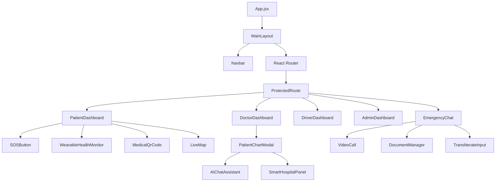

# FRONTEND ARCHITECTURE GUIDE
**Project:** Life Saviour  
**Framework:** React (Vite)  
**UI Library:** Chakra UI  

This guide provides a comprehensive breakdown of the frontend client application, detailing the state management, routing, component hierarchy, and performance optimizations.

---

## 1. Folder Structure
The application follows a highly modular, feature-separated structure.

```text
/client/src
├── /assets         # Static images, icons, global CSS
├── /components     # Reusable building blocks (SOSButton, VideoCall, Map)
├── /contexts       # Global React Contexts (AuthContext, LanguageContext)
├── /hooks          # Custom React hooks (useOfflineSync, useAuth)
├── /i18n           # Multilingual translation dictionaries (translations.js)
├── /layouts        # Page wrappers (Navbar, Footer, MainLayout)
├── /pages          # Top-level route components (Dashboards, Login, Chat)
├── /services       # API wrappers, Socket.IO client, IndexedDB offline service
├── App.jsx         # Root router configuration
└── main.jsx        # DOM rendering and Context Provider wrapping
```

---

## 2. Component Tree & Dependency Diagram



---

## 3. Routing & 12. Protected Routes
Routing is handled by `react-router-dom`.
- **Public Routes:** `/login`, `/signup`.
- **Protected Routes:** All dashboards and chat functionalities are wrapped in a `<ProtectedRoute>` component.
- **Role-Based Guards:** The `ProtectedRoute` component intercepts the route request, checks `AuthContext.user.role`, and redirects unauthorized users (e.g., stopping a Patient from accessing `/dashboard/admin`).

---

## 4. Layouts
- **MainLayout:** Wraps all authenticated pages. It provides the global `Navbar` (which contains the Notification Bell, Language Selector, and User Profile dropdown) and ensures consistent margins and max-width containers for the main content area.

---

## 5. Context Providers & 7. State Management
Life Saviour intentionally avoids heavy state managers like Redux, instead opting for the native **React Context API** combined with localized component state.

- **`AuthContext.jsx`:** Stores the JWT token, the decoded `user` object, and exposes `login()`, `logout()` functions.
- **`LanguageContext.jsx`:** Stores the active locale (`en`, `hi`, `te`) and exposes the `t(key)` translation function to all child components.
- **Why no Redux?** The most volatile state (Live Emergency Tracking) is pushed continuously from the server via WebSockets. It is much more efficient to bind Socket listeners directly inside `PatientDashboard` and update local state than to dispatch hundreds of Redux actions per minute for GPS coordinate updates.

---

## 6. Custom Hooks
- **`useAuth()`:** Syntactic sugar for `useContext(AuthContext)`.
- **`useOfflineSync()`:** Listens to `window` `online`/`offline` events and triggers the IndexedDB flush when connection is restored.
- **`useDynamicTranslation()`:** Intercepts strings and applies AI/static translations.

---

## 8. API Layer
All HTTP communication is centralized in `/services/api.js`.
- Utilizes `axios`.
- **Interceptors:** A request interceptor automatically attaches the `Bearer <token>` from `localStorage` to every request. A response interceptor catches `401 Unauthorized` responses and automatically triggers a logout, ensuring the UI doesn't break if a token expires.

---

## 9. UI Components & 10. Reusable Components
The UI is built using **Chakra UI** primitives (`Box`, `Flex`, `Button`, `Modal`).
Major reusable components:
1. **`VideoCall.jsx`:** Encapsulates the entire PeerJS WebRTC handshake and `getUserMedia` video stream rendering. Highly decoupled so it can be embedded in Dashboards or the Chat page.
2. **`DocumentManager.jsx`:** Encapsulates the Multer-backed file upload logic and file previews.
3. **`TransliterateInput.jsx`:** Wraps a standard textarea to allow Roman-to-Indic script conversion for multilingual typing.
4. **`DynamicText.jsx`:** A wrapper component that applies translation logic to its children.

---

## 11. Pages
- **`PatientDashboard.jsx`:** The most complex page. It conditionally renders entirely different UI states depending on whether `activeEmergency` is null or populated.
- **`EmergencyChat.jsx`:** Handles real-time messaging. Manages a React `ref` to auto-scroll to the bottom on new messages.
- **`CityCommandCenter.jsx`:** Heavy on geospatial data. Renders the Leaflet map and plots hundreds of hotspot circles.

---

## 13. Lazy Loading
To optimize bundle size, heavy routes are lazy-loaded using `React.lazy()` and `<Suspense>`.
```jsx
const CityCommandCenter = React.lazy(() => import('./pages/CityCommandCenter'));
// Prevents the heavy Leaflet.js library from loading for patients who will never visit the Admin page.
```

---

## 14. Error Boundaries
React Error Boundaries (custom class components implementing `componentDidCatch`) wrap critical, volatile sections of the app—specifically the **VideoCall** and **Map** components. If PeerJS or Leaflet throws an unhandled exception, the Error Boundary catches it, prevents the white screen of death, and displays a graceful "Component failed to load" fallback UI.

---

## 15. Form Handling & 16. Validation
Forms (like the main Emergency Report) utilize **React Hook Form**.
- **Why?** It manages form state via uncontrolled inputs (using `refs`), which drastically reduces re-renders on every keystroke compared to standard React `useState`.
- **Validation:** Enforced via Chakra UI form validation states (`isInvalid`). Rules (e.g., minimum length, required fields) are validated client-side before submission to save network requests, matching the backend validation rules perfectly.

---

## 17. Performance Optimizations
1. **Socket Debouncing:** Driver GPS coordinates are not tied directly to React state on every millisecond change. They are debounced to prevent React from triggering massive DOM repaints.
2. **Memoization:** Expensive components (like the `LiveMap`) are wrapped in `React.memo()` to prevent unnecessary re-renders when parent state (like a chat message arriving) changes.
3. **Tree Shaking:** By using Vite and ES Modules, unused Chakra UI components and date libraries are stripped from the final production bundle.
4. **IndexedDB over LocalStorage:** Used for offline queueing because it doesn't block the main UI thread, ensuring the app remains 60fps even when saving large base64 wearable snapshots.
