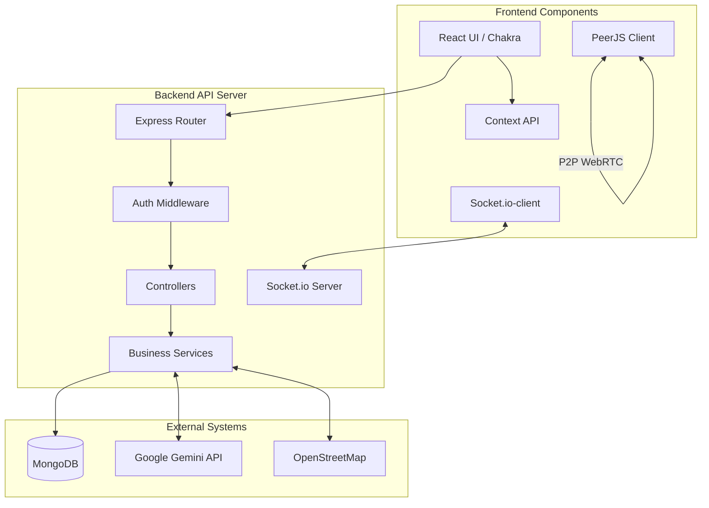
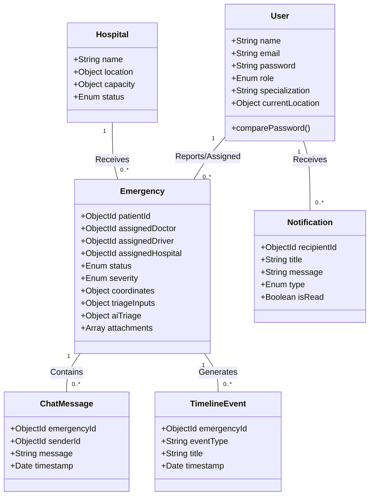
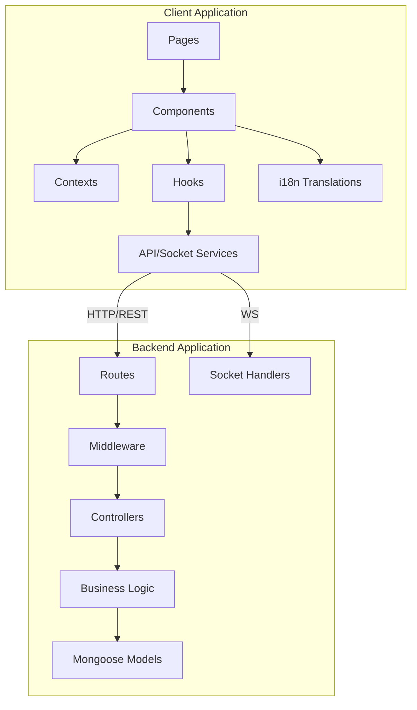
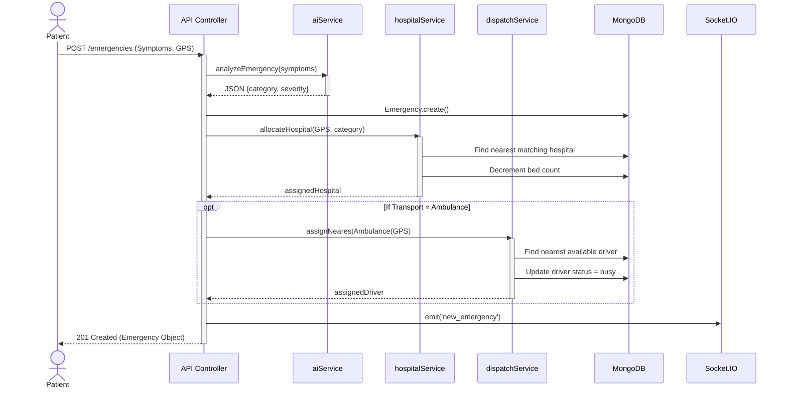
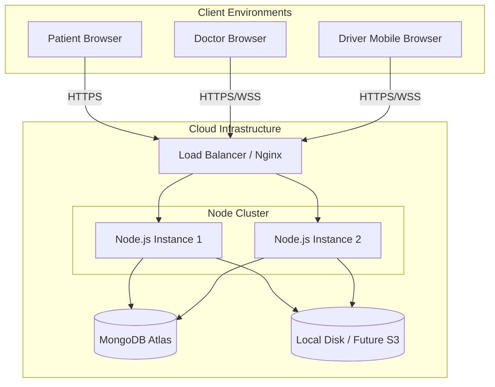
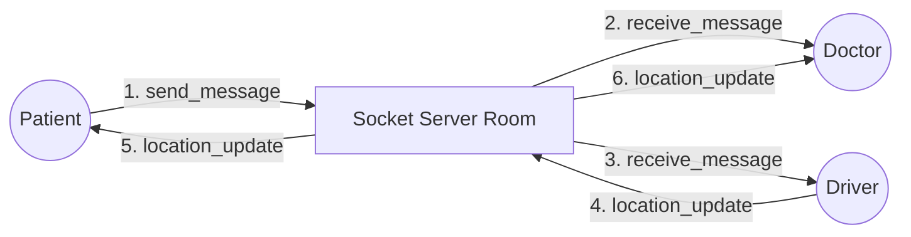
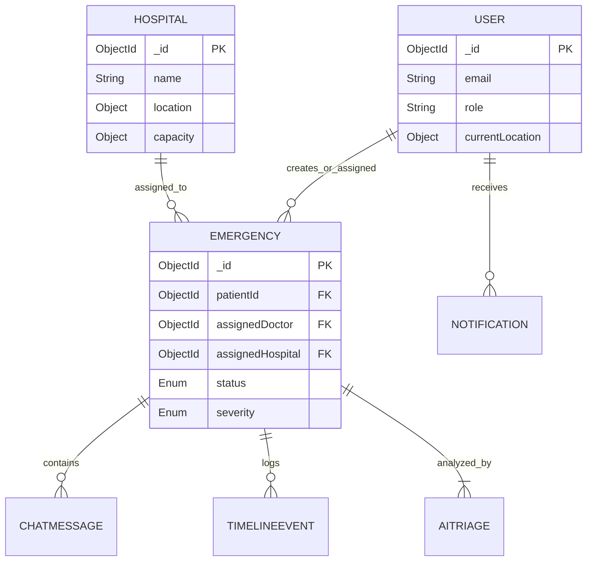
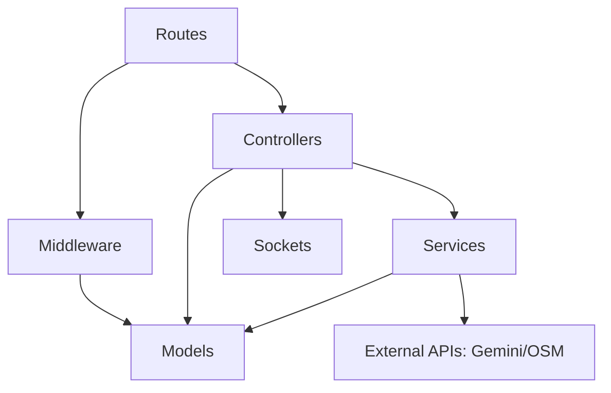
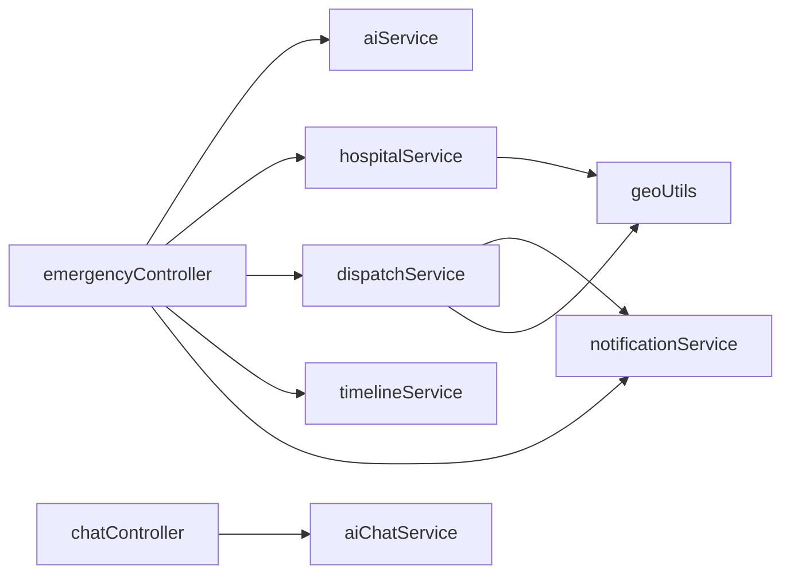

# SOFTWARE DESIGN DOCUMENT (SDD)
**Project Name:** Life Saviour  
**Document Version:** 1.0  
**Prepared By:** Principal Software Engineer  
**Date:** July 2026  

---

## 1. High-Level Architecture
Life Saviour operates on a client-server architecture utilizing the MERN stack (MongoDB, Express.js, React, Node.js). The system is fundamentally event-driven, relying heavily on WebSockets (Socket.IO) for real-time state synchronization across distributed clients (Patients, Doctors, Drivers, Admins) and WebRTC (PeerJS) for peer-to-peer media streaming. External integrations form a critical backbone, specifically Google Gemini for NLP/Triage and OpenStreetMap for geospatial calculations.

*Architectural Decision:* A monolith Node.js/Express server was chosen over microservices to minimize deployment complexity and network latency between tightly coupled domains (e.g., Triage must instantly trigger Dispatch).

## 2. Frontend Architecture
The frontend is a Single Page Application (SPA) built with React and Vite. 
- **State Management:** Utilizes React Context API for global state (Auth, Language) and local component state for localized concerns, avoiding the boilerplate of Redux.
- **UI Framework:** Chakra UI provides accessible, composable component primitives.
- **Routing:** React Router DOM manages role-based guarded routes.
- **Side Effects & Data Fetching:** Handled via custom hooks and `fetch`/`axios` wrappers communicating with the REST API.

*Architectural Decision:* React Context API was selected for state management because the primary dynamic state (Emergency Tracking) is managed via Socket.IO events rather than complex client-side REST mutations, making Redux overkill.

## 3. Backend Architecture
The backend follows a layered MVC-Service architecture:
- **Routes Layer:** Defines API endpoints and attaches middleware (Auth, File Uploads).
- **Controller Layer:** Handles HTTP request/response formatting and payload validation.
- **Service Layer:** Encapsulates core business logic (e.g., `aiService`, `hospitalService`). This keeps controllers thin.
- **Data Access Layer:** Mongoose models abstract MongoDB interactions.

*Architectural Decision:* The strict separation of Controllers and Services allows internal backend tasks (like a Socket event needing to allocate a hospital) to call `hospitalService` directly without mocking an HTTP request.

## 4. Database Architecture
The system uses MongoDB as its primary datastore. It leverages a document-oriented design to store complex, nested data structures (like `aiTriage` metadata) within a single `Emergency` document, minimizing expensive SQL-style joins.

*Architectural Decision:* MongoDB was chosen due to the highly variable nature of emergency data (e.g., varying symptom objects, IoT wearable snapshots, diverse file attachments). 

## 5. AI Architecture
The AI architecture integrates Google Gemini (gemini-2.5-flash) for rapid text analysis. 
- **Triage Pipeline:** Prompts are injected with patient symptoms and enforced to output strict JSON schemas.
- **Chat Pipeline:** Maintains an alternating `user`/`model` history array, utilizing `systemInstruction` to dictate persona and language.
- **Fallback Mechanism:** A deterministic regex/keyword parser acts as a circuit breaker if the AI API times out or hallucinates invalid JSON.

*Architectural Decision:* The 'flash' model was selected over 'pro' models to prioritize sub-second latency, which is critical in an emergency context.

## 6. Socket.IO Architecture
Real-time communication is facilitated via Socket.IO using a "Room" based pattern. 
- Each active emergency spawns a unique socket room (`socket.join(emergencyId)`).
- Patients, Doctors, and Drivers associated with that emergency join the room to receive isolated broadcasts (chat messages, live GPS coordinates, vitals).

*Architectural Decision:* Room-based multiplexing prevents the frontend from filtering irrelevant global events and strictly scopes data delivery for privacy.

## 7. IoT Architecture
The IoT architecture bridges physical hardware and web software using the Web Bluetooth API.
- The client browser establishes a GATT connection to wearable devices (Heart Rate service).
- Vitals are read continuously. If thresholds are breached, the client triggers the SOS payload to the server.
- The system includes an in-memory software simulator for development/testing without physical hardware.

*Architectural Decision:* Web Bluetooth was chosen to avoid requiring users to install native mobile apps, maintaining the frictionless nature of a pure web application.

## 8. Deployment Architecture (Intended)
While current code runs locally, the intended deployment architecture is:
- **Client:** Static hosting via Vercel or AWS S3/CloudFront.
- **API Server:** Containerized Docker images on AWS ECS or Railway.
- **Database:** MongoDB Atlas (managed cluster).
- **WebSockets:** Requires Sticky Sessions enabled on the load balancer to prevent Socket.IO connection drops.

---

## 9. Component Diagram



---

## 10. Class Diagram (Mongoose Models)



---

## 11. Package Diagram



---

## 12. Sequence Diagrams

### Emergency Creation & Auto-Dispatch Cascade



---

## 13. Deployment Diagram



---

## 14. Communication Diagram



---

## 15. Entity Relationship Diagram



---

## 16. Folder Structure

```text
/life
├── /client
│   ├── /src
│   │   ├── /assets
│   │   ├── /components    # Reusable UI parts (VideoCall, DocumentManager)
│   │   ├── /contexts      # AuthContext, LanguageContext
│   │   ├── /hooks         # useOfflineSync, useDynamicTranslation
│   │   ├── /i18n          # translations.js
│   │   ├── /layouts       # Navbar, Footer
│   │   ├── /pages         # Role-based Dashboards, Auth pages
│   │   ├── /services      # api.js, socket.js, offlineService.js
│   │   └── App.jsx
│   └── package.json
└── /server
    ├── /src
    │   ├── /config        # db.js
    │   ├── /controllers   # HTTP handlers (auth, emergency, chat)
    │   ├── /middleware    # auth.js, upload.js
    │   ├── /models        # Mongoose schemas (User, Emergency)
    │   ├── /routes        # API route definitions
    │   ├── /services      # Core business logic (aiService, hospitalService)
    │   ├── /sockets       # Socket.IO event listeners
    │   └── /utils         # geoUtils.js
    ├── server.js          # Entry point
    └── package.json
```

---

## 17. Module Dependency Graph



---

## 18. Service Dependency Graph



---

## 19. Design Patterns Used
1. **Singleton Pattern:** The database connection (`config/db.js`) and the Socket.IO instance initialization ensure only one shared connection pool exists application-wide.
2. **Factory Pattern:** Mongoose models act as factories for creating data document instances.
3. **Observer / Pub-Sub Pattern:** Socket.IO fundamentally implements this pattern. The server acts as a broker, and clients subscribe to specific rooms (`emergencyId`) to observe state changes.
4. **Strategy Pattern:** The fallback logic in `aiService.js` implements a strategy pattern. If the `GeminiStrategy` fails, it dynamically switches to the `KeywordFallbackStrategy` to execute the triage.
5. **Facade Pattern:** `api.js` on the client-side acts as a facade, abstracting the complexities of Axios, interceptors, and token injection away from the React components.

---

## 20. SOLID Principles Applied
- **Single Responsibility Principle (SRP):** Controllers strictly handle HTTP concerns (req/res), while Services (e.g., `aiService`) strictly handle domain logic.
- **Open/Closed Principle (OCP):** The Socket server is designed to easily accept new event listeners without modifying the core connection lifecycle engine.
- **Liskov Substitution Principle (LSP):** The system uses a single `User` model with polymorphic capabilities via the `role` enum. Any function expecting a `User` can accept a Doctor or Admin without breaking.
- **Interface Segregation Principle (ISP):** Instead of a massive God-endpoint, the API is segregated (e.g., `/api/chat`, `/api/emergencies`, `/api/iot`) so clients only depend on the endpoints they need.
- **Dependency Inversion Principle (DIP):** The frontend relies on abstractions (`offlineService.js`) to submit emergencies, abstracting away whether the data is going to Axios or IndexedDB.

---

## 21. Scalability Considerations
- **Stateless Authentication:** Using JWTs means the backend does not need to synchronize session memory across multiple Node servers.
- **Database Indexing:** Queries rely on indexes. For example, filtering active emergencies uses indexed fields like `status` and `assignedHospital`.
- **Throttling:** Socket GPS broadcasts from the driver are debounced to a 5-second interval, reducing network I/O overhead by thousands of percent compared to continuous streaming.
- **Limitation:** The current Multer implementation writes files to the local disk (`/uploads/`). To scale horizontally behind a load balancer, this must be refactored to use a cloud blob store (AWS S3).

---

## 22. Security Design
- **Authentication:** bcrypt hashing (salt rounds: 12) prevents brute-forcing of stolen database dumps.
- **Authorization:** `protect` and `authorize('role')` middleware ensure strict vertical and horizontal privilege escalation prevention.
- **Data Privacy:** WebRTC (PeerJS) connections are peer-to-peer and inherently encrypted via DTLS/SRTP, meaning the server never intercepts the video feed.
- **Input Sanitization:** Gemini prompts are sanitized. The AI chat service restricts history arrays to the last 10 messages to prevent token-smuggling or prompt injection buffer overflows.

---

## 23. Performance Design
- **Background Processing:** AI Chat Summary generation is executed asynchronously during the doctor assignment route. It does not `await` the LLM response before returning `200 OK` to the client.
- **Lazy Load Mapping:** The heavy Leaflet map libraries and OpenStreetMap tiles are only rendered conditionally when an emergency enters the `assigned` state.
- **Bundle Size:** Utilizing Vite ensures rapid HMR during development and aggressive dead-code elimination (tree-shaking) for production builds.

---

## 24. Error Handling Strategy
- **Client-Side:** Axios interceptors catch global 401/403 errors and auto-logout the user. UI errors are presented via non-blocking Chakra UI Toasts.
- **Server-Side:** Express error handling middleware acts as a global catch block.
- **Circuit Breakers:** `aiService` wraps the Gemini API call in a `try/catch`. If an error occurs (timeout, rate limit), it swallows the error, logs it, and silently executes the fallback deterministic regex triage so the user is never blocked.

---

## 25. Logging Strategy
- **Current State:** Development logging relies on `console.log` and `console.error`.
- **Production Standard (Recommendation):** Implementation of a structured logging library (like Winston or Pino) to format logs as JSON, enabling ingestion into systems like Datadog or ELK Stack for observability.

---

## 26. Monitoring Strategy
- **Application Level:** The `timelineService` natively tracks state transitions (Created -> Assigned -> Resolved) acting as an internal audit log.
- **Analytics Dashboard:** The backend aggregates performance KPIs (Average Response Time, Hospital Network Load) in real-time, providing immediate visibility into system health.

---

## 27. Future Architecture Improvements
1. **Cloud Blob Storage:** Refactoring Multer to `multer-s3` for stateless horizontal scaling.
2. **Redis Adapter for Socket.IO:** To allow WebSocket communication to bridge across multiple Node instances in a cluster.
3. **Message Queue (RabbitMQ/Kafka):** Decoupling the massive `POST /emergencies` synchronous cascade into async background workers.
4. **Geospatial Indexes:** Migrating Haversine mathematical distance calculations to MongoDB `2dsphere` indexes (`$near` queries) for massive scale database-level geospatial routing.
5. **Turn/Stun Servers:** Deploying dedicated TURN servers (e.g., Coturn) for PeerJS to ensure WebRTC connections succeed across strict enterprise firewalls.
