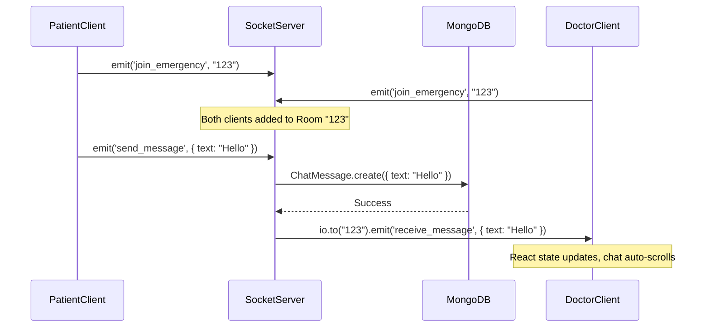
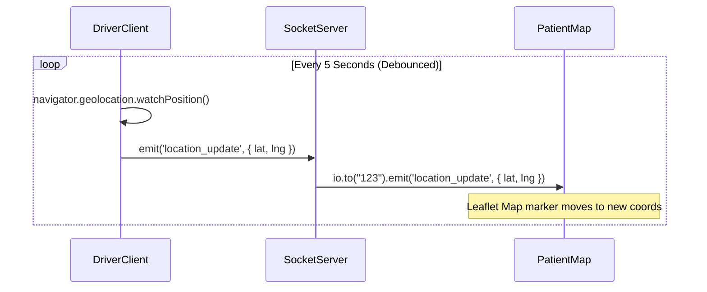

# SOCKET.IO ARCHITECTURE GUIDE
**Project:** Life Saviour  
**Engine:** Socket.IO v4  

This document details the real-time communication engine of the Life Saviour platform. WebSockets power the most critical features of the app: live chat, live ambulance tracking, real-time vital monitoring, and instant status updates.

---

## 1. Server Initialization
Standard Express applications cannot handle WebSockets natively. In `server/server.js`, the Express `app` is wrapped with Node's native `http.createServer`.
```javascript
const app = express();
const server = http.createServer(app);
const io = new Server(server, { cors: { origin: '*' } });
```
This allows both REST APIs and WebSockets to share the same port (e.g., 5000). 

**The `req.io` Pattern:**
To allow standard HTTP REST routes (like `POST /emergencies`) to trigger real-time updates without tightly coupling the socket logic, the `io` instance is injected globally into the Express request object:
```javascript
app.use((req, res, next) => { req.io = io; next(); });
```

## 2. Client Connection
The client initializes the connection in `client/src/services/socket.js`. It exports a singleton socket instance that is imported by React components.
- By default, Socket.IO implements **auto-reconnection** with exponential backoff. If the server drops or the patient's mobile network switches towers, the client automatically attempts to reconnect without user intervention.

## 3. Rooms & 4. Broadcasting
Life Saviour strictly uses a **Room-based architecture** to isolate data.
- Broadcasting an event using `io.emit()` sends it to *every connected user globally*. This is inefficient and highly insecure for private medical data.
- Instead, when a user enters an active emergency view, their client emits a `join_emergency` event with the `emergencyId`.
- The server executes `socket.join(emergencyId)`.
- All subsequent broadcasts (chat, location) are fired using `io.to(emergencyId).emit(...)`. This guarantees that only the patient, doctor, and driver assigned to *that specific emergency* receive the packets.

---

## 5. Event Flow Sequence Diagrams

### 5.1 Real-Time Chat Event Flow
When a user sends a chat message, the system persists it to MongoDB and broadcasts it simultaneously.



### 5.2 Live Ambulance Location Tracking
The ambulance driver constantly broadcasts their GPS to the patient and doctor.



---

## 6. Core System Events

| Event Name | Direction | Payload | Purpose |
|------------|-----------|---------|---------|
| `join_emergency` | Client → Server | `emergencyId` | Subscribes the client to a specific emergency room. |
| `new_emergency` | Server → Client | `Emergency` Object | Global emit to alert all online doctors of a new pending case. |
| `emergency_updated`| Server → Client | `Emergency` Object | Sent by HTTP controllers when status changes (e.g., Doctor Assigned). Forces React to re-fetch or update state. |
| `send_message` | Client → Server | `ChatMessage` Object | Triggers database persistence. |
| `receive_message` | Server → Client | `ChatMessage` Object | Appends a new message to the chat UI. |
| `typing` / `stop_typing` | Client ↔ Server | `userId` | Triggers the "User is typing..." UI indicator. |
| `location_update` | Client ↔ Server | `{ lat, lng }` | Updates the ambulance marker on the Live Map. |
| `new_attachment` | Server → Client | `Attachment` Object | Alerts the room that a new file (X-ray, etc.) was uploaded via HTTP. |
| `wearable_update` | Client ↔ Server | `{ hr, spo2 }` | Pushes live IoT vital readings from the patient to the doctor's chart. |

---

## 7. Performance Optimizations

WebSockets can easily overwhelm a client browser if too much data is sent too quickly (causing React to re-render thousands of times per minute). Life Saviour implements strict **Debouncing & Throttling**:
1. **Location Debouncing:** The browser's Geolocation API can fire hundreds of coordinate changes per minute when driving. The Driver dashboard restricts the `location_update` emit to fire a maximum of once every **5 seconds**.
2. **Typing Debouncing:** The `typing` event is not emitted on every keystroke. It emits once, and a client-side `setTimeout` triggers `stop_typing` if 2 seconds pass without a keystroke.
3. **IoT Vitals Throttling:** Wearable vitals are broadcast once every **3 seconds** instead of continuously streaming raw Bluetooth buffer data.

---

## 8. Scaling Socket.IO

Currently, the Socket.IO instance operates entirely in the memory of a single Node.js process. This works perfectly for a single server, but introduces severe issues when attempting to scale horizontally.

**The Scaling Problem:**
If we put our API behind an AWS Application Load Balancer and spin up 3 Node.js instances:
1. Patient connects to **Server A**.
2. Doctor connects to **Server B**.
3. Patient emits a chat message to Server A. Server A broadcasts to its local memory of the room.
4. **Result:** The Doctor never receives the message because they are connected to a different server.

**The Architectural Solution:**
To scale this application, we must implement two changes:
1. **Sticky Sessions:** Configure the Load Balancer to route all WebSocket packets from a specific IP address to the same backend server instance.
2. **Redis Adapter (`@socket.io/redis-adapter`):** Connect all Node.js instances to a centralized Redis cluster. When Server A receives a chat message, it publishes the event to Redis. Server B instantly subscribes to that event and pushes it down to the Doctor. This bridges the memory gap across the distributed cluster.
