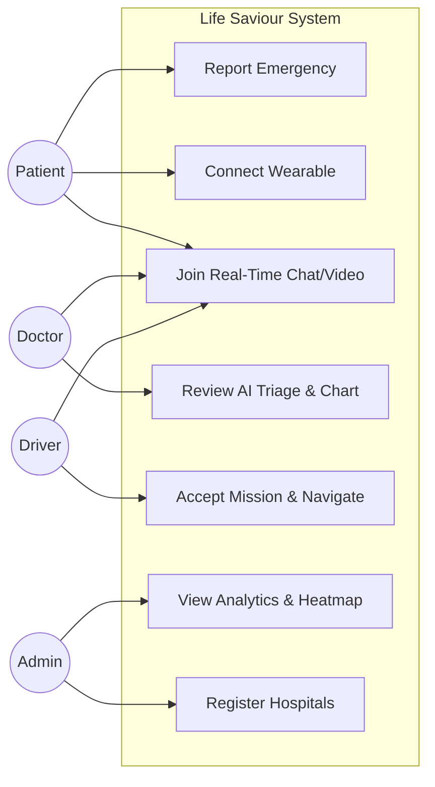
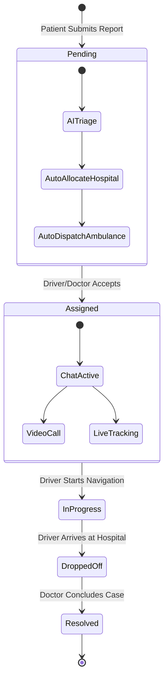
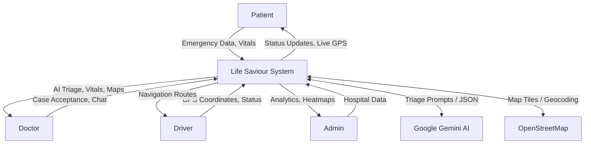
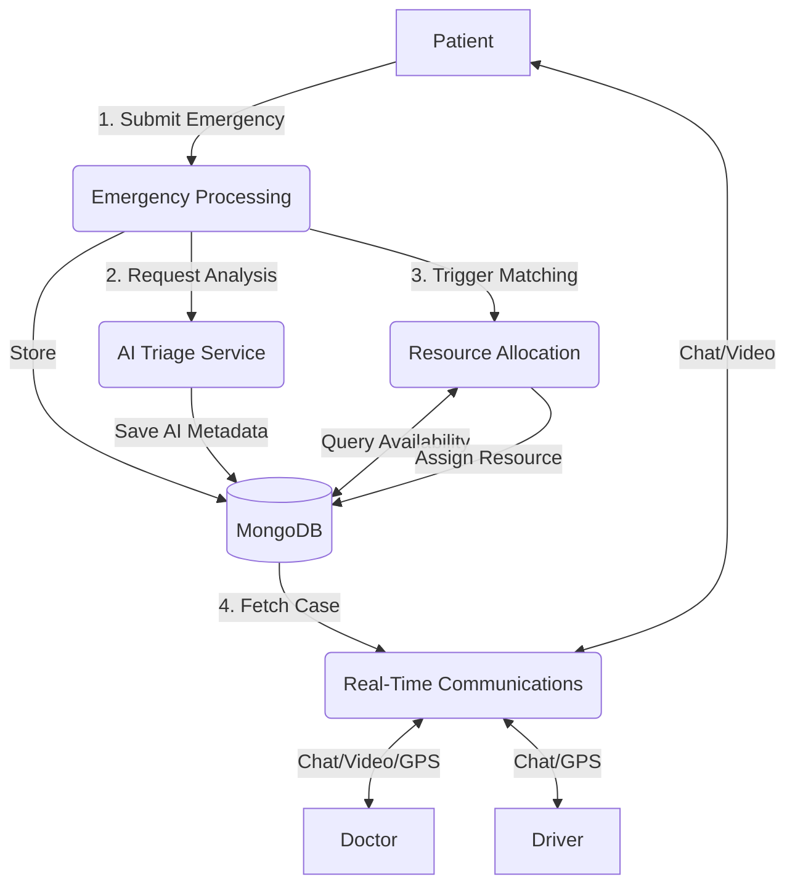
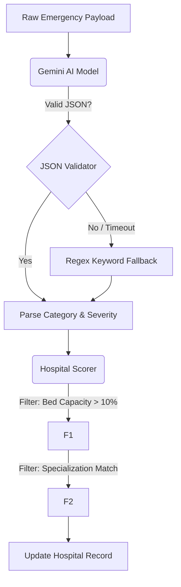

# SOFTWARE REQUIREMENTS SPECIFICATION (SRS)
**Project Name:** Life Saviour  
**Document Version:** 1.0  
**Prepared By:** Senior Software Architect  
**Date:** July 2026  

---

## 1. Project Overview
Life Saviour is a comprehensive, real-time emergency medical response platform designed to bridge the gap between patients, doctors, ambulance drivers, and hospital administrators. It leverages AI-driven triage (via Google Gemini), Internet of Things (IoT) wearable integrations, and real-time WebRTC/Socket communications to significantly reduce emergency response times and streamline medical interventions.

## 2. Problem Statement
In critical medical emergencies, the delay between incident reporting and medical intervention is often fatal. Traditional emergency response systems rely on manual dispatching, sequential communication, and disjointed data gathering, leading to resource misallocation and critical time lost.

## 3. Existing Problems
- High latency in emergency reporting and dispatch via phone calls.
- Inability to objectively assess severity at the point of contact without a doctor present.
- Misrouting of patients to hospitals without specialized doctors or available beds/ICU units.
- Lack of real-time patient vitals during transit for remote assessment.
- Communication silos between patients, dispatchers, drivers, and hospitals.
- Language barriers during distress communication in multi-lingual populations.

## 4. Proposed Solution
Life Saviour introduces a single unified platform offering:
- **One-tap SOS and voice reporting** to eliminate reporting friction.
- **AI-driven pre-triage and chat** to instantly categorize severity and gather clinical context.
- **Automated algorithmic allocation** of the nearest ambulance and best-fit hospital.
- **Real-time collaboration** via peer-to-peer video calls, live chat, and GPS tracking.
- **Wearable integration** for continuous autonomous monitoring and automatic SOS triggers.

## 5. Project Goals
- To reduce end-to-end emergency response and dispatch time.
- To eliminate manual triage bottlenecks using artificial intelligence.
- To ensure patients are routed only to facilities capable of treating their specific condition.
- To provide a continuous stream of clinical data from the incident site to the operating room.

## 6. Objectives
- Achieve sub-second AI triage evaluation for incoming emergencies.
- Maintain real-time (sub-5 second latency) synchronization of GPS and patient vitals.
- Provide 100% uptime on emergency creation via offline-queueing capabilities.
- Support seamless multilingual interaction across English, Hindi, and Telugu.

## 7. Scope
The scope of Life Saviour encompasses the client-facing web application and the backend API architecture. It includes four distinct user portals (Patient, Doctor, Driver, Admin) interacting over a shared real-time socket infrastructure. Hardware (actual physical wearable devices) is outside the scope of this software specification, though the software includes the Bluetooth interfaces and simulators to integrate with them.

## 8. Stakeholders
- **Patients:** End-users requiring emergency medical assistance.
- **Doctors / Medical Professionals:** Responders evaluating cases and directing care.
- **Ambulance Drivers:** Personnel executing the physical transport.
- **Hospital Administrators:** Personnel managing hospital capacity and network status.
- **System Administrators:** IT staff managing the platform infrastructure.

## 9. User Roles
1. **Patient:** Can report emergencies, manage medical IDs, connect wearables, upload documents, and view real-time maps.
2. **Doctor:** Can view filtered emergency queues, accept cases, view AI summaries, access patient charts, initiate video calls, and resolve cases.
3. **Driver:** Can accept transport missions, broadcast live location, navigate, and update transit status.
4. **Admin:** Can register new hospitals, monitor city-wide capacity heatmaps, and view system analytics.

---

## 10. Functional Requirements
### FR-1: Authentication & Authorization
- The system must allow users to register with distinct roles using email and password.
- The system must secure API access using JSON Web Tokens (JWT).
- The system must enforce role-based access control (RBAC) on all protected routes.

### FR-2: Emergency Reporting
- The system must allow patients to submit an emergency report manually, via voice transcription, or via a one-tap SOS button.
- The system must allow offline submission and auto-sync when connectivity is restored.

### FR-3: AI Triage & Analysis
- The system must analyze emergency symptoms using Google Gemini AI to determine severity, category, and priority.
- The system must fall back to keyword-based deterministic triage if the AI service is unavailable.
- The system must provide a pre-triage AI chat assistant to gather context from the patient.

### FR-4: Auto-Allocation
- The system must automatically assign the nearest available ambulance driver.
- The system must automatically recommend and allocate a hospital based on proximity, bed availability, and specialty match.

### FR-5: Real-Time Communication
- The system must provide real-time text chat supporting image uploads.
- The system must support WebRTC peer-to-peer video calls between doctors and patients.
- The system must push event-driven notifications (e.g., "Doctor Assigned") to users.

### FR-6: Location Tracking
- The system must track the live GPS location of ambulance drivers and broadcast it to the assigned emergency channel.
- The system must display this location on an interactive map for patients and doctors.

### FR-7: IoT Wearable Integration
- The system must connect to Bluetooth-enabled wearables to extract real-time heart rate and SpO2.
- The system must trigger an automatic SOS if critical vital thresholds are breached and a 15-second countdown is not aborted.

### FR-8: System Administration
- The system must provide an Analytics Dashboard for historical and real-time operational insights.
- The system must provide a Command Center heatmap visualizing emergency hotspots and hospital loads.

---

## 11. Non-Functional Requirements
### NFR-1: Performance
- Real-time socket events (chat, location, vitals) must reflect on clients within 500ms.
- Triage AI responses must be processed asynchronously to avoid blocking the main Node.js event loop.

### NFR-2: Scalability
- The backend must be stateless (via JWT) to support horizontal scaling across multiple instances.
- Socket.IO must be adaptable to use a Redis adapter for multi-node deployments.

### NFR-3: Reliability & Availability
- The system must implement offline-first capabilities using IndexedDB for queuing emergency reports during network outages.

### NFR-4: Security
- Passwords must be hashed using bcrypt (cost factor 12).
- Video calls must use WebRTC built-in encryption.

### NFR-5: Usability (i18n)
- The system must support dynamic UI and AI translation in English, Hindi, and Telugu.

---

## 12. Business Requirements
- **BR-1:** The platform must reduce average dispatch times by automating the dispatcher role.
- **BR-2:** The platform must ensure hospitals are not overwhelmed by actively rerouting low-priority cases when capacity exceeds 90%.

---

## 13. User Stories
- **US-1:** As a patient, I want to press a single SOS button so that an emergency is created instantly with my GPS location and Medical ID.
- **US-2:** As a doctor, I want to see an AI-generated summary of the patient's chat history so that I can understand their condition before initiating a video call.
- **US-3:** As a driver, I want to broadcast my live location automatically so that the patient knows exactly when I will arrive.
- **US-4:** As an admin, I want to see a city heatmap so I can identify zones with high emergency frequencies.

---

## 14. Use Cases
1. **UC-1: Report Emergency (Patient)** - Patient fills form/triggers SOS. System creates record, runs AI triage, assigns resources.
2. **UC-2: Manage Emergency (Doctor)** - Doctor accepts emergency, reviews AI chart, joins video call, marks as resolved.
3. **UC-3: Transport Patient (Driver)** - Driver accepts mission, broadcasts GPS, marks arrival.
4. **UC-4: Monitor City Load (Admin)** - Admin views analytics, registers new hospitals to balance load.

---

## 15. Use Case Diagram

---

## 16. Activity Diagrams

### Emergency Lifecycle Activity Diagram

---

## 17. Data Flow Diagrams

### Level 0 Context Diagram

### Level 1 DFD: Core System Processes

### Level 2 DFD: Triage & Allocation Sub-Process

---

## 18. Functional Modules
1. **Authentication Module:** Handles JWT generation, password hashing, and RBAC.
2. **Emergency Core Engine:** Manages CRUD operations and state transitions (`pending`, `assigned`, `in_progress`, `dropped_off`, `resolved`) for emergencies.
3. **AI Intelligence Module:** Interfaces with Gemini API for triage scoring and NLP chat assistance.
4. **IoT & Wearables Module:** Manages Web Bluetooth API connections and vital threshold alerting.
5. **Real-Time Collaboration Module:** Oversees Socket.IO rooms, chat persistence, and PeerJS WebRTC handshakes.
6. **Geospatial & Dispatch Module:** Handles Haversine distance calculations, nearest-driver matching, and heatmap aggregations.
7. **Document Management:** Processes multipart/form-data for X-rays, prescriptions, and images using Multer.
8. **Audit & Notifications Module:** Maintains immutable timeline logs and distributes in-app push alerts.

---

## 19. Constraints
- **Hardware Limitations:** Bluetooth wearable integration requires HTTPS or localhost context and compatible client hardware.
- **API Limits:** AI Triage is constrained by the rate limits of the external Google Gemini API.
- **Storage:** Medical documents are currently stored on the local server file system, limiting stateless horizontal scaling without migration to S3.

---

## 20. Assumptions
- It is assumed that ambulances and hospitals have dedicated personnel monitoring their respective dashboards.
- It is assumed that users possess a baseline smartphone capable of accessing browser geolocation and camera hardware.
- It is assumed that offline-queued emergencies will not be delayed beyond clinical relevance before regaining connectivity.

---

## 21. Risks
1. **AI Hallucination:** Gemini returning incorrect triage categories. *Mitigation: AI data is clearly marked as advisory, and severe cases default upward in priority. Keyword fallback guarantees continuity.*
2. **Network Drops During Transport:** Loss of live tracking. *Mitigation: Last known coordinates are cached, and connection retry logic is built into the socket client.*
3. **Hospital Over-Allocation:** Race conditions leading to negative bed counts. *Mitigation: MongoDB atomic `$inc` operators ensure thread-safe capacity decrementing.*

---

## 22. Future Enhancements
- Migration of the Multer local storage engine to AWS S3.
- Implementing Push API and Service Workers for out-of-app background notifications.
- Using Redis Pub/Sub to scale Socket.IO across multiple load-balanced node instances.
- Adding Twilio VoIP SIP integration for the "Emergency Support 108" call button.
- Extracting the AI summary mechanism to analyze uploaded medical documents directly (OCR/Vision).

---

## 23. Acceptance Criteria
- **AC-1:** A patient must be able to submit an emergency and have it reflected in the database within 1 second.
- **AC-2:** The AI Triage must respond or trigger the fallback mechanism within 5 seconds of form submission.
- **AC-3:** Doctors must only see emergencies in their queue that match their registered `hospitalAffiliation`.
- **AC-4:** Chat messages must broadcast to all participants in the specific `emergencyId` room within 500 milliseconds.
- **AC-5:** A driver going offline must not crash the application, and their last known location marker must remain on the map.
